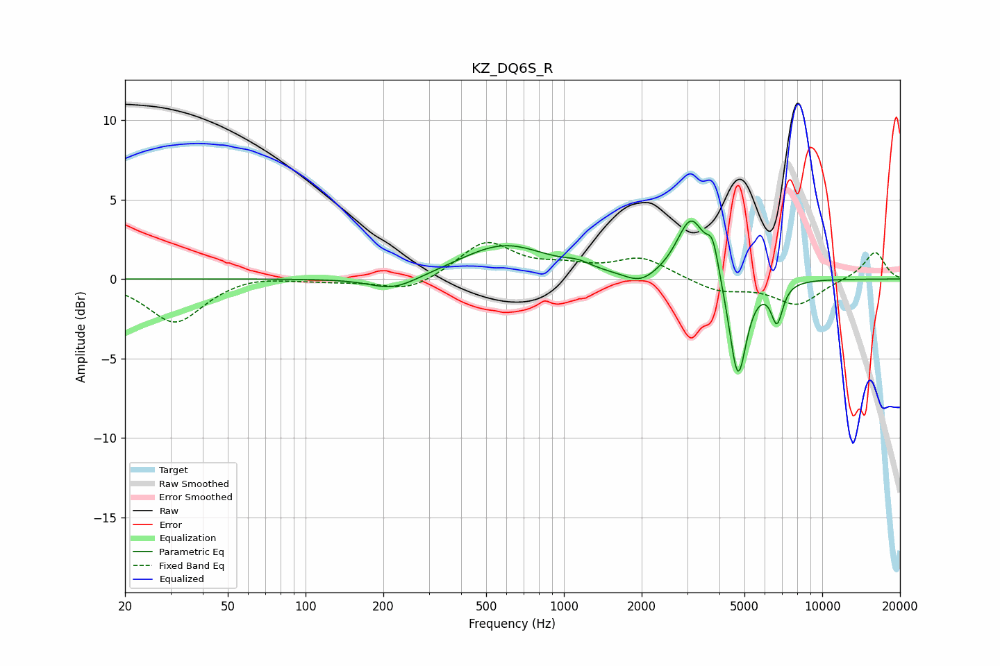

# KZ_DQ6S_R
See [usage instructions](https://github.com/jaakkopasanen/AutoEq#usage) for more options and info.

### Parametric EQs
Apply preamp of -3.8 dB when using parametric equalizer.

|   # | Type    |   Fc (Hz) |    Q |   Gain (dB) |
|-----|---------|-----------|------|-------------|
|   1 | Peaking |       173 | 1.53 |         0.1 |
|   2 | Peaking |       217 | 1.38 |        -1   |
|   3 | Peaking |       588 | 0.83 |         2.2 |
|   4 | Peaking |      1132 | 2.84 |         0.4 |
|   5 | Peaking |      1979 | 2.29 |        -0.7 |
|   6 | Peaking |      3032 | 2.31 |         0.3 |
|   7 | Peaking |      3113 | 2.6  |         3.5 |
|   8 | Peaking |      3770 | 5.94 |         2   |
|   9 | Peaking |      4715 | 4.16 |        -6.6 |
|  10 | Peaking |      6682 | 6    |        -2.5 |

### Fixed Band EQs
When using fixed band (also called graphic) equalizer, apply preamp of **-2.4 dB** (if available) and set gains manually with these parameters.

|   # | Type    |   Fc (Hz) |    Q |   Gain (dB) |
|-----|---------|-----------|------|-------------|
|   1 | Peaking |        31 | 1.41 |        -2.8 |
|   2 | Peaking |        62 | 1.41 |         0.3 |
|   3 | Peaking |       125 | 1.41 |        -0.1 |
|   4 | Peaking |       250 | 1.41 |        -0.8 |
|   5 | Peaking |       500 | 1.41 |         2.3 |
|   6 | Peaking |      1000 | 1.41 |         0.6 |
|   7 | Peaking |      2000 | 1.41 |         1.3 |
|   8 | Peaking |      4000 | 1.41 |        -0.8 |
|   9 | Peaking |      8000 | 1.41 |        -1.6 |
|  10 | Peaking |     16000 | 1.41 |         1.8 |

### Graphs

