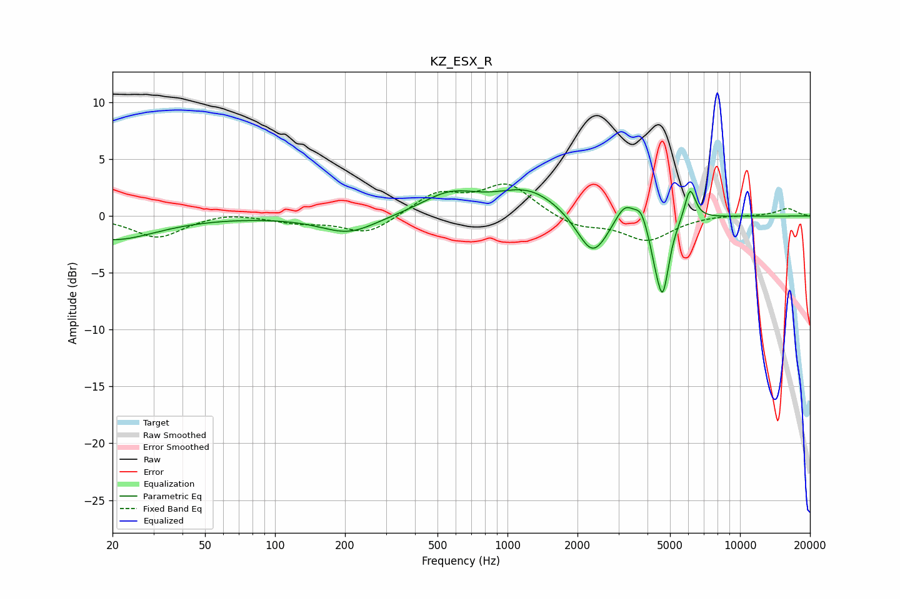

# KZ_ESX_R
See [usage instructions](https://github.com/jaakkopasanen/AutoEq#usage) for more options and info.

### Parametric EQs
Apply preamp of -2.4 dB when using parametric equalizer.

|   # | Type    |   Fc (Hz) |    Q |   Gain (dB) |
|-----|---------|-----------|------|-------------|
|   1 | Peaking |        20 | 0.77 |        -2.1 |
|   2 | Peaking |       207 | 1.17 |        -1.6 |
|   3 | Peaking |       565 | 1.16 |         1.8 |
|   4 | Peaking |      1235 | 1.02 |         2.3 |
|   5 | Peaking |      2325 | 2.1  |        -3.9 |
|   6 | Peaking |      3200 | 3.3  |         1.8 |
|   7 | Peaking |      3748 | 5.97 |         1.1 |
|   8 | Peaking |      4296 | 6    |        -1.3 |
|   9 | Peaking |      4651 | 5.08 |        -6.5 |
|  10 | Peaking |      6096 | 6    |         2.9 |

### Fixed Band EQs
When using fixed band (also called graphic) equalizer, apply preamp of **-2.9 dB** (if available) and set gains manually with these parameters.

|   # | Type    |   Fc (Hz) |    Q |   Gain (dB) |
|-----|---------|-----------|------|-------------|
|   1 | Peaking |        31 | 1.41 |        -1.9 |
|   2 | Peaking |        62 | 1.41 |         0.4 |
|   3 | Peaking |       125 | 1.41 |        -0.5 |
|   4 | Peaking |       250 | 1.41 |        -1.6 |
|   5 | Peaking |       500 | 1.41 |         1.9 |
|   6 | Peaking |      1000 | 1.41 |         2.7 |
|   7 | Peaking |      2000 | 1.41 |        -1   |
|   8 | Peaking |      4000 | 1.41 |        -2.1 |
|   9 | Peaking |      8000 | 1.41 |         0.1 |
|  10 | Peaking |     16000 | 1.41 |         0.7 |

### Graphs

