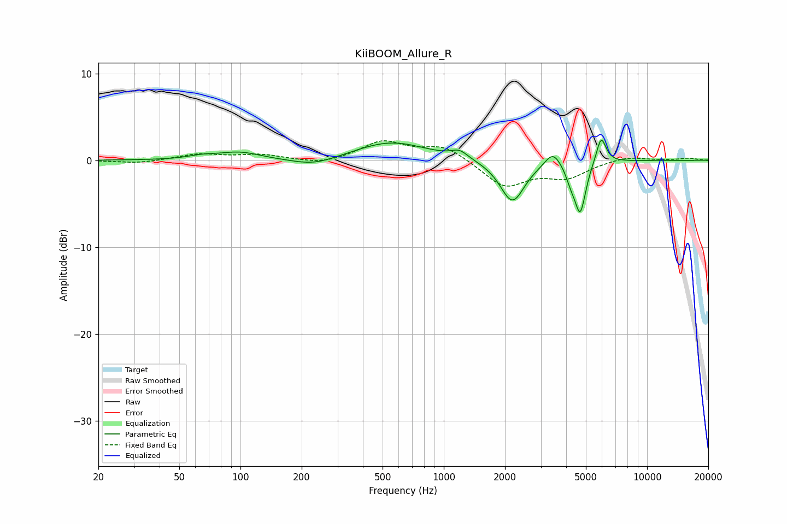

# KiiBOOM_Allure_R
See [usage instructions](https://github.com/jaakkopasanen/AutoEq#usage) for more options and info.

### Parametric EQs
Apply preamp of -2.4 dB when using parametric equalizer.

|   # | Type    |   Fc (Hz) |    Q |   Gain (dB) |
|-----|---------|-----------|------|-------------|
|   1 | Peaking |        65 | 2.03 |         0.4 |
|   2 | Peaking |        99 | 1.4  |         0.9 |
|   3 | Peaking |       230 | 1.27 |        -0.9 |
|   4 | Peaking |       551 | 0.81 |         2.1 |
|   5 | Peaking |      1196 | 3.45 |         0.9 |
|   6 | Peaking |      2174 | 2.37 |        -4.9 |
|   7 | Peaking |      3439 | 3.71 |         1.7 |
|   8 | Peaking |      4209 | 6    |        -1.4 |
|   9 | Peaking |      4688 | 5.17 |        -5.8 |
|  10 | Peaking |      5944 | 5.8  |         3.1 |

### Fixed Band EQs
When using fixed band (also called graphic) equalizer, apply preamp of **-2.3 dB** (if available) and set gains manually with these parameters.

|   # | Type    |   Fc (Hz) |    Q |   Gain (dB) |
|-----|---------|-----------|------|-------------|
|   1 | Peaking |        31 | 1.41 |        -0.4 |
|   2 | Peaking |        62 | 1.41 |         0.7 |
|   3 | Peaking |       125 | 1.41 |         0.6 |
|   4 | Peaking |       250 | 1.41 |        -0.5 |
|   5 | Peaking |       500 | 1.41 |         2.1 |
|   6 | Peaking |      1000 | 1.41 |         1.7 |
|   7 | Peaking |      2000 | 1.41 |        -3   |
|   8 | Peaking |      4000 | 1.41 |        -1.8 |
|   9 | Peaking |      8000 | 1.41 |         0.5 |
|  10 | Peaking |     16000 | 1.41 |         0.2 |

### Graphs

