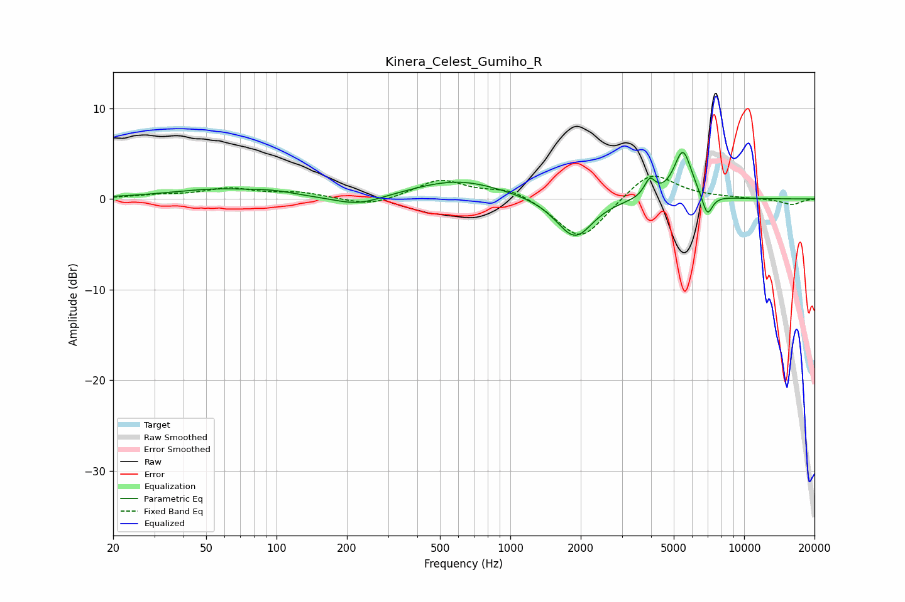

# Kinera_Celest_Gumiho_R
See [usage instructions](https://github.com/jaakkopasanen/AutoEq#usage) for more options and info.

### Parametric EQs
Apply preamp of -5.2 dB when using parametric equalizer.

|   # | Type    |   Fc (Hz) |    Q |   Gain (dB) |
|-----|---------|-----------|------|-------------|
|   1 | Peaking |        57 | 0.65 |         1   |
|   2 | Peaking |        98 | 1.63 |         0.3 |
|   3 | Peaking |       223 | 1.34 |        -1.1 |
|   4 | Peaking |       597 | 0.73 |         2.1 |
|   5 | Peaking |      1699 | 1.82 |        -0.6 |
|   6 | Peaking |      1908 | 1.91 |        -3.9 |
|   7 | Peaking |      3951 | 6    |         1.9 |
|   8 | Peaking |      5470 | 3.59 |         5.4 |
|   9 | Peaking |      6962 | 5.94 |        -2.6 |
|  10 | Peaking |      7217 | 6    |         0.1 |

### Fixed Band EQs
When using fixed band (also called graphic) equalizer, apply preamp of **-2.6 dB** (if available) and set gains manually with these parameters.

|   # | Type    |   Fc (Hz) |    Q |   Gain (dB) |
|-----|---------|-----------|------|-------------|
|   1 | Peaking |        31 | 1.41 |         0.3 |
|   2 | Peaking |        62 | 1.41 |         1.1 |
|   3 | Peaking |       125 | 1.41 |         0.6 |
|   4 | Peaking |       250 | 1.41 |        -0.9 |
|   5 | Peaking |       500 | 1.41 |         2.1 |
|   6 | Peaking |      1000 | 1.41 |         1.2 |
|   7 | Peaking |      2000 | 1.41 |        -4.7 |
|   8 | Peaking |      4000 | 1.41 |         3.2 |
|   9 | Peaking |      8000 | 1.41 |         0.1 |
|  10 | Peaking |     16000 | 1.41 |        -0.6 |

### Graphs

