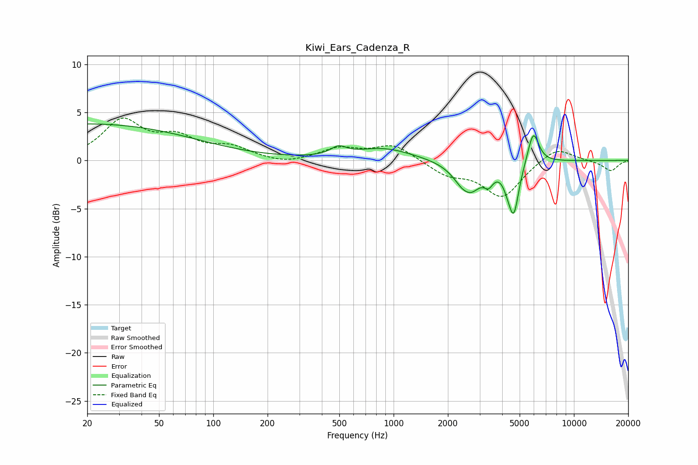

# Kiwi_Ears_Cadenza_R
See [usage instructions](https://github.com/jaakkopasanen/AutoEq#usage) for more options and info.

### Parametric EQs
Apply preamp of -3.9 dB when using parametric equalizer.

|   # | Type    |   Fc (Hz) |    Q |   Gain (dB) |
|-----|---------|-----------|------|-------------|
|   1 | Peaking |        20 | 0.23 |         3.8 |
|   2 | Peaking |       495 | 3.32 |         0.9 |
|   3 | Peaking |       883 | 0.89 |         1.2 |
|   4 | Peaking |      2549 | 5.57 |         0.3 |
|   5 | Peaking |      2583 | 2.18 |        -3.5 |
|   6 | Peaking |      3362 | 5.53 |        -1.2 |
|   7 | Peaking |      4244 | 5.99 |        -0.6 |
|   8 | Peaking |      4434 | 4.34 |        -0.4 |
|   9 | Peaking |      4639 | 4.89 |        -5   |
|  10 | Peaking |      5953 | 4.54 |         3.4 |

### Fixed Band EQs
When using fixed band (also called graphic) equalizer, apply preamp of **-4.5 dB** (if available) and set gains manually with these parameters.

|   # | Type    |   Fc (Hz) |    Q |   Gain (dB) |
|-----|---------|-----------|------|-------------|
|   1 | Peaking |        31 | 1.41 |         4   |
|   2 | Peaking |        62 | 1.41 |         2   |
|   3 | Peaking |       125 | 1.41 |         1.2 |
|   4 | Peaking |       250 | 1.41 |        -0.5 |
|   5 | Peaking |       500 | 1.41 |         1.2 |
|   6 | Peaking |      1000 | 1.41 |         1.6 |
|   7 | Peaking |      2000 | 1.41 |        -1.4 |
|   8 | Peaking |      4000 | 1.41 |        -3.8 |
|   9 | Peaking |      8000 | 1.41 |         1.5 |
|  10 | Peaking |     16000 | 1.41 |        -1.1 |

### Graphs

