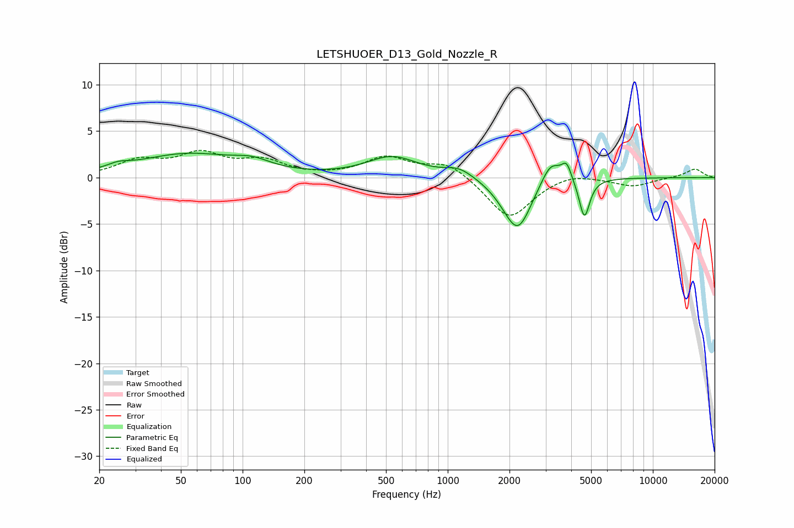

# LETSHUOER_D13_Gold_Nozzle_R
See [usage instructions](https://github.com/jaakkopasanen/AutoEq#usage) for more options and info.

### Parametric EQs
Apply preamp of -2.7 dB when using parametric equalizer.

|   # | Type    |   Fc (Hz) |    Q |   Gain (dB) |
|-----|---------|-----------|------|-------------|
|   1 | Peaking |        25 | 2.72 |         0.5 |
|   2 | Peaking |        54 | 0.58 |         2.5 |
|   3 | Peaking |       112 | 1.6  |         0.9 |
|   4 | Peaking |       536 | 1.14 |         2.2 |
|   5 | Peaking |      1137 | 1.98 |         1   |
|   6 | Peaking |      1918 | 1.91 |        -0.7 |
|   7 | Peaking |      2203 | 2.15 |        -5.2 |
|   8 | Peaking |      3180 | 2.93 |         2.5 |
|   9 | Peaking |      3797 | 6    |         1.7 |
|  10 | Peaking |      4637 | 5.53 |        -4.3 |

### Fixed Band EQs
When using fixed band (also called graphic) equalizer, apply preamp of **-3.0 dB** (if available) and set gains manually with these parameters.

|   # | Type    |   Fc (Hz) |    Q |   Gain (dB) |
|-----|---------|-----------|------|-------------|
|   1 | Peaking |        31 | 1.41 |         1.7 |
|   2 | Peaking |        62 | 1.41 |         2.3 |
|   3 | Peaking |       125 | 1.41 |         1.6 |
|   4 | Peaking |       250 | 1.41 |         0   |
|   5 | Peaking |       500 | 1.41 |         2.1 |
|   6 | Peaking |      1000 | 1.41 |         1.7 |
|   7 | Peaking |      2000 | 1.41 |        -4.5 |
|   8 | Peaking |      4000 | 1.41 |         0.7 |
|   9 | Peaking |      8000 | 1.41 |        -0.9 |
|  10 | Peaking |     16000 | 1.41 |         1   |

### Graphs

