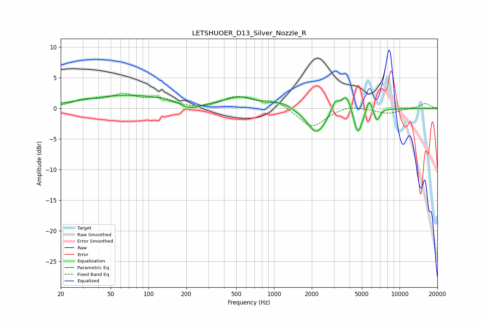

# LETSHUOER_D13_Silver_Nozzle_R
See [usage instructions](https://github.com/jaakkopasanen/AutoEq#usage) for more options and info.

### Parametric EQs
Apply preamp of -2.2 dB when using parametric equalizer.

|   # | Type    |   Fc (Hz) |    Q |   Gain (dB) |
|-----|---------|-----------|------|-------------|
|   1 | Peaking |        71 | 0.38 |         2.2 |
|   2 | Peaking |       215 | 1.82 |        -1.2 |
|   3 | Peaking |       548 | 1.11 |         1.7 |
|   4 | Peaking |      1150 | 1.85 |         0.8 |
|   5 | Peaking |      2174 | 1.96 |        -4.1 |
|   6 | Peaking |      3062 | 5.64 |         1.6 |
|   7 | Peaking |      3773 | 3.19 |         3.1 |
|   8 | Peaking |      4647 | 3.89 |        -4.6 |
|   9 | Peaking |      5731 | 5.96 |         2.3 |
|  10 | Peaking |      6586 | 6    |        -2   |

### Fixed Band EQs
When using fixed band (also called graphic) equalizer, apply preamp of **-2.6 dB** (if available) and set gains manually with these parameters.

|   # | Type    |   Fc (Hz) |    Q |   Gain (dB) |
|-----|---------|-----------|------|-------------|
|   1 | Peaking |        31 | 1.41 |         1.2 |
|   2 | Peaking |        62 | 1.41 |         2   |
|   3 | Peaking |       125 | 1.41 |         1.4 |
|   4 | Peaking |       250 | 1.41 |        -0.3 |
|   5 | Peaking |       500 | 1.41 |         1.8 |
|   6 | Peaking |      1000 | 1.41 |         1.3 |
|   7 | Peaking |      2000 | 1.41 |        -3.2 |
|   8 | Peaking |      4000 | 1.41 |         0.6 |
|   9 | Peaking |      8000 | 1.41 |        -0.8 |
|  10 | Peaking |     16000 | 1.41 |         0.8 |

### Graphs

