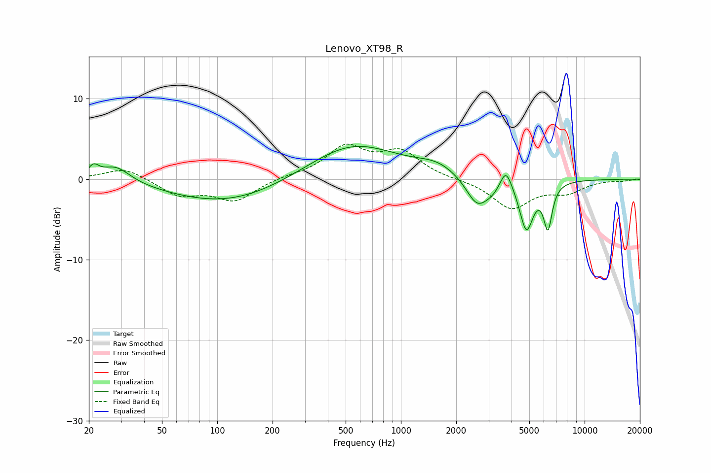

# Lenovo_XT98_R
See [usage instructions](https://github.com/jaakkopasanen/AutoEq#usage) for more options and info.

### Parametric EQs
Apply preamp of -4.2 dB when using parametric equalizer.

|   # | Type    |   Fc (Hz) |    Q |   Gain (dB) |
|-----|---------|-----------|------|-------------|
|   1 | Peaking |        21 | 4.88 |         1.4 |
|   2 | Peaking |        28 | 1.81 |         2   |
|   3 | Peaking |       113 | 0.45 |        -3   |
|   4 | Peaking |       544 | 0.58 |         4.5 |
|   5 | Peaking |      1578 | 1.26 |         1.3 |
|   6 | Peaking |      2585 | 2.36 |        -3.2 |
|   7 | Peaking |      3253 | 1.98 |        -1.6 |
|   8 | Peaking |      3720 | 4.03 |         3.2 |
|   9 | Peaking |      4822 | 3.74 |        -6   |
|  10 | Peaking |      6312 | 6    |        -5.4 |

### Fixed Band EQs
When using fixed band (also called graphic) equalizer, apply preamp of **-4.4 dB** (if available) and set gains manually with these parameters.

|   # | Type    |   Fc (Hz) |    Q |   Gain (dB) |
|-----|---------|-----------|------|-------------|
|   1 | Peaking |        31 | 1.41 |         1.5 |
|   2 | Peaking |        62 | 1.41 |        -2   |
|   3 | Peaking |       125 | 1.41 |        -2.6 |
|   4 | Peaking |       250 | 1.41 |         0.3 |
|   5 | Peaking |       500 | 1.41 |         3.8 |
|   6 | Peaking |      1000 | 1.41 |         3.2 |
|   7 | Peaking |      2000 | 1.41 |        -0   |
|   8 | Peaking |      4000 | 1.41 |        -3.6 |
|   9 | Peaking |      8000 | 1.41 |        -1.5 |
|  10 | Peaking |     16000 | 1.41 |        -0.2 |

### Graphs

