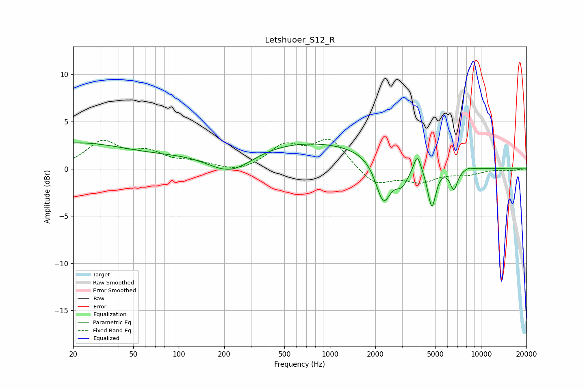

# Letshuoer_S12_R
See [usage instructions](https://github.com/jaakkopasanen/AutoEq#usage) for more options and info.

### Parametric EQs
Apply preamp of -2.8 dB when using parametric equalizer.

|   # | Type    |   Fc (Hz) |    Q |   Gain (dB) |
|-----|---------|-----------|------|-------------|
|   1 | Peaking |        20 | 0.38 |         2.7 |
|   2 | Peaking |       219 | 0.87 |        -2.9 |
|   3 | Peaking |       501 | 0.2  |         3.1 |
|   4 | Peaking |      2259 | 2.76 |        -4.6 |
|   5 | Peaking |      2992 | 3.15 |        -2   |
|   6 | Peaking |      3791 | 6    |         1.5 |
|   7 | Peaking |      3804 | 6    |         0.3 |
|   8 | Peaking |      4727 | 5.16 |        -4.3 |
|   9 | Peaking |      6610 | 5.54 |        -2.2 |
|  10 | Peaking |      8305 | 5.4  |         0.2 |

### Fixed Band EQs
When using fixed band (also called graphic) equalizer, apply preamp of **-3.2 dB** (if available) and set gains manually with these parameters.

|   # | Type    |   Fc (Hz) |    Q |   Gain (dB) |
|-----|---------|-----------|------|-------------|
|   1 | Peaking |        31 | 1.41 |         2.7 |
|   2 | Peaking |        62 | 1.41 |         1.5 |
|   3 | Peaking |       125 | 1.41 |         0.6 |
|   4 | Peaking |       250 | 1.41 |        -0.5 |
|   5 | Peaking |       500 | 1.41 |         2.3 |
|   6 | Peaking |      1000 | 1.41 |         3   |
|   7 | Peaking |      2000 | 1.41 |        -1.8 |
|   8 | Peaking |      4000 | 1.41 |        -1.2 |
|   9 | Peaking |      8000 | 1.41 |        -0.5 |
|  10 | Peaking |     16000 | 1.41 |        -0.1 |

### Graphs

