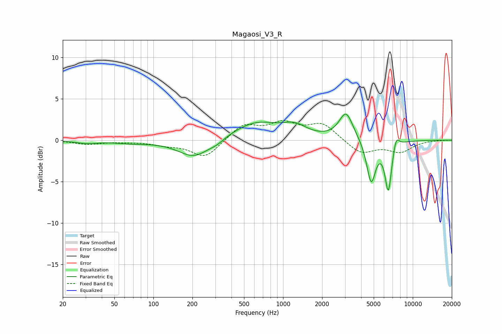

# Magaosi_V3_R
See [usage instructions](https://github.com/jaakkopasanen/AutoEq#usage) for more options and info.

### Parametric EQs
Apply preamp of -3.2 dB when using parametric equalizer.

|   # | Type    |   Fc (Hz) |    Q |   Gain (dB) |
|-----|---------|-----------|------|-------------|
|   1 | Peaking |        31 | 1.68 |        -0.3 |
|   2 | Peaking |        68 | 1.13 |        -0.3 |
|   3 | Peaking |       207 | 1.14 |        -2.2 |
|   4 | Peaking |       310 | 2.73 |        -0.4 |
|   5 | Peaking |       621 | 0.77 |         2.2 |
|   6 | Peaking |      1236 | 1.59 |         1.2 |
|   7 | Peaking |      3062 | 2.63 |         3.3 |
|   8 | Peaking |      4777 | 4.01 |        -5.1 |
|   9 | Peaking |      6483 | 5.29 |        -5.9 |
|  10 | Peaking |      7445 | 5.84 |         1.5 |

### Fixed Band EQs
When using fixed band (also called graphic) equalizer, apply preamp of **-2.5 dB** (if available) and set gains manually with these parameters.

|   # | Type    |   Fc (Hz) |    Q |   Gain (dB) |
|-----|---------|-----------|------|-------------|
|   1 | Peaking |        31 | 1.41 |        -0.5 |
|   2 | Peaking |        62 | 1.41 |        -0.1 |
|   3 | Peaking |       125 | 1.41 |        -0.5 |
|   4 | Peaking |       250 | 1.41 |        -2.1 |
|   5 | Peaking |       500 | 1.41 |         1.9 |
|   6 | Peaking |      1000 | 1.41 |         1.8 |
|   7 | Peaking |      2000 | 1.41 |         1.9 |
|   8 | Peaking |      4000 | 1.41 |        -1.6 |
|   9 | Peaking |      8000 | 1.41 |        -1.3 |
|  10 | Peaking |     16000 | 1.41 |         0   |

### Graphs

