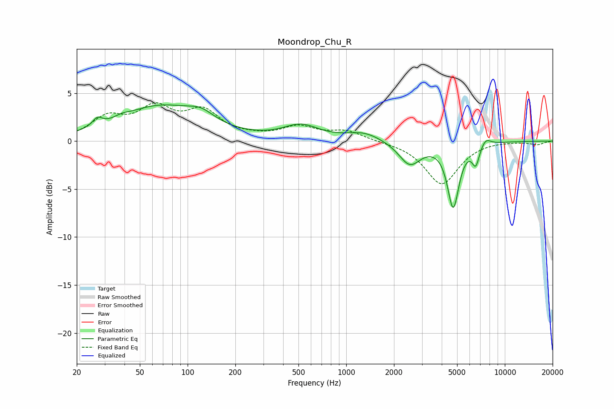

# Moondrop_Chu_R
See [usage instructions](https://github.com/jaakkopasanen/AutoEq#usage) for more options and info.

### Parametric EQs
Apply preamp of -3.9 dB when using parametric equalizer.

|   # | Type    |   Fc (Hz) |    Q |   Gain (dB) |
|-----|---------|-----------|------|-------------|
|   1 | Peaking |        27 | 4.73 |         0.9 |
|   2 | Peaking |        38 | 3.44 |         0.3 |
|   3 | Peaking |        67 | 0.55 |         3.5 |
|   4 | Peaking |       121 | 1.68 |         1   |
|   5 | Peaking |       519 | 1.26 |         1.5 |
|   6 | Peaking |      1295 | 1.33 |         0.9 |
|   7 | Peaking |      2516 | 2.06 |        -2.4 |
|   8 | Peaking |      4727 | 3.87 |        -6.7 |
|   9 | Peaking |      6553 | 6    |        -2   |
|  10 | Peaking |      7578 | 4.4  |         0.8 |

### Fixed Band EQs
When using fixed band (also called graphic) equalizer, apply preamp of **-4.1 dB** (if available) and set gains manually with these parameters.

|   # | Type    |   Fc (Hz) |    Q |   Gain (dB) |
|-----|---------|-----------|------|-------------|
|   1 | Peaking |        31 | 1.41 |         2.2 |
|   2 | Peaking |        62 | 1.41 |         3.1 |
|   3 | Peaking |       125 | 1.41 |         2.8 |
|   4 | Peaking |       250 | 1.41 |         0.3 |
|   5 | Peaking |       500 | 1.41 |         1.4 |
|   6 | Peaking |      1000 | 1.41 |         1   |
|   7 | Peaking |      2000 | 1.41 |        -0   |
|   8 | Peaking |      4000 | 1.41 |        -4.5 |
|   9 | Peaking |      8000 | 1.41 |         0.1 |
|  10 | Peaking |     16000 | 1.41 |        -0.3 |

### Graphs

