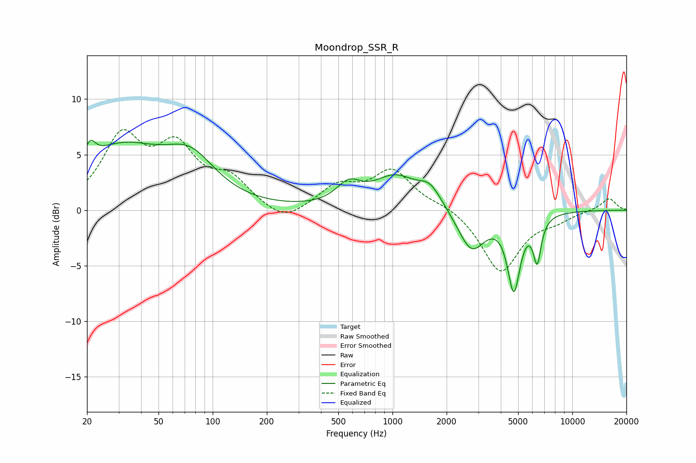

# Moondrop_SSR_R
See [usage instructions](https://github.com/jaakkopasanen/AutoEq#usage) for more options and info.

### Parametric EQs
Apply preamp of -6.4 dB when using parametric equalizer.

|   # | Type    |   Fc (Hz) |    Q |   Gain (dB) |
|-----|---------|-----------|------|-------------|
|   1 | Peaking |        21 | 4.96 |         1.6 |
|   2 | Peaking |        31 | 0.58 |         5.3 |
|   3 | Peaking |        75 | 1.02 |         3.5 |
|   4 | Peaking |       571 | 2.08 |         1.8 |
|   5 | Peaking |      1037 | 1.16 |         2.8 |
|   6 | Peaking |      1621 | 2.19 |         1.7 |
|   7 | Peaking |      2750 | 1.88 |        -3.7 |
|   8 | Peaking |      4731 | 3.99 |        -6.7 |
|   9 | Peaking |      6392 | 6    |        -6   |
|  10 | Peaking |      6410 | 5.68 |         2.1 |

### Fixed Band EQs
When using fixed band (also called graphic) equalizer, apply preamp of **-7.4 dB** (if available) and set gains manually with these parameters.

|   # | Type    |   Fc (Hz) |    Q |   Gain (dB) |
|-----|---------|-----------|------|-------------|
|   1 | Peaking |        31 | 1.41 |         6.2 |
|   2 | Peaking |        62 | 1.41 |         5   |
|   3 | Peaking |       125 | 1.41 |         2.4 |
|   4 | Peaking |       250 | 1.41 |        -1.4 |
|   5 | Peaking |       500 | 1.41 |         2   |
|   6 | Peaking |      1000 | 1.41 |         3.4 |
|   7 | Peaking |      2000 | 1.41 |         0.5 |
|   8 | Peaking |      4000 | 1.41 |        -5.6 |
|   9 | Peaking |      8000 | 1.41 |        -0.7 |
|  10 | Peaking |     16000 | 1.41 |         1.1 |

### Graphs

