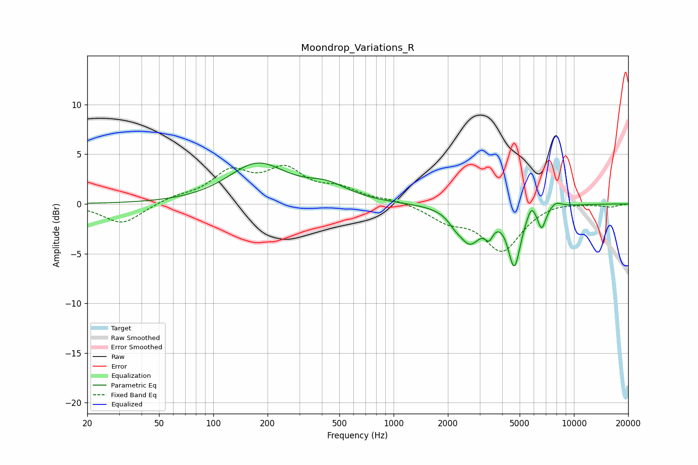

# Moondrop_Variations_R
See [usage instructions](https://github.com/jaakkopasanen/AutoEq#usage) for more options and info.

### Parametric EQs
Apply preamp of -4.2 dB when using parametric equalizer.

|   # | Type    |   Fc (Hz) |    Q |   Gain (dB) |
|-----|---------|-----------|------|-------------|
|   1 | Peaking |       176 | 0.88 |         3.9 |
|   2 | Peaking |       425 | 1.17 |         1.4 |
|   3 | Peaking |      2175 | 4.26 |        -0.6 |
|   4 | Peaking |      2643 | 2.22 |        -3.6 |
|   5 | Peaking |      3383 | 5.99 |        -1.5 |
|   6 | Peaking |      4673 | 4.06 |        -5.8 |
|   7 | Peaking |      5816 | 6    |         1.2 |
|   8 | Peaking |      6615 | 6    |        -1.7 |
|   9 | Peaking |      6695 | 6    |        -0.4 |
|  10 | Peaking |      7935 | 4.32 |         0.5 |

### Fixed Band EQs
When using fixed band (also called graphic) equalizer, apply preamp of **-4.0 dB** (if available) and set gains manually with these parameters.

|   # | Type    |   Fc (Hz) |    Q |   Gain (dB) |
|-----|---------|-----------|------|-------------|
|   1 | Peaking |        31 | 1.41 |        -2.1 |
|   2 | Peaking |        62 | 1.41 |         0.6 |
|   3 | Peaking |       125 | 1.41 |         3   |
|   4 | Peaking |       250 | 1.41 |         3.1 |
|   5 | Peaking |       500 | 1.41 |         1.3 |
|   6 | Peaking |      1000 | 1.41 |         0.4 |
|   7 | Peaking |      2000 | 1.41 |        -1.5 |
|   8 | Peaking |      4000 | 1.41 |        -4.6 |
|   9 | Peaking |      8000 | 1.41 |         0.3 |
|  10 | Peaking |     16000 | 1.41 |        -0.3 |

### Graphs

