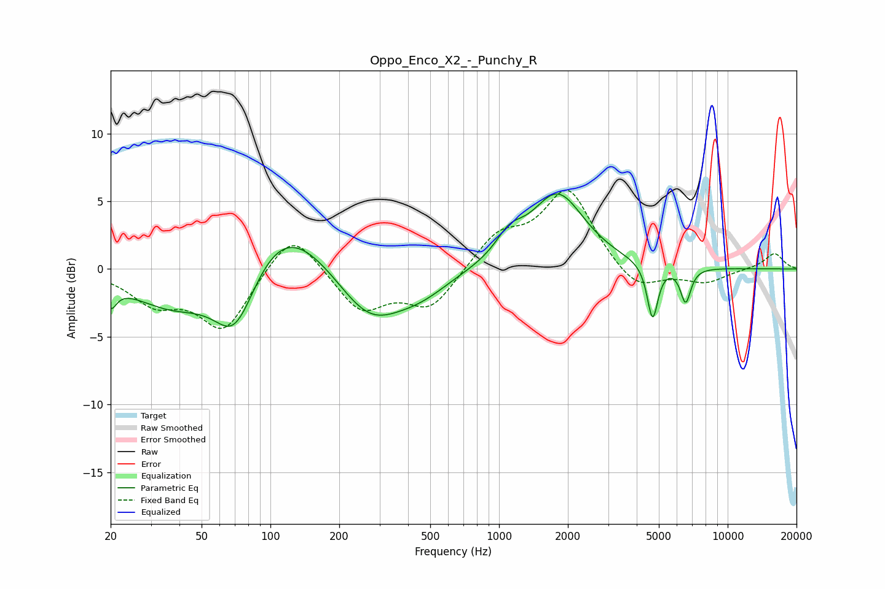

# Oppo_Enco_X2_-_Punchy_R
See [usage instructions](https://github.com/jaakkopasanen/AutoEq#usage) for more options and info.

### Parametric EQs
Apply preamp of -5.6 dB when using parametric equalizer.

|   # | Type    |   Fc (Hz) |    Q |   Gain (dB) |
|-----|---------|-----------|------|-------------|
|   1 | Peaking |        20 | 5.58 |        -1.6 |
|   2 | Peaking |        38 | 0.76 |        -2.8 |
|   3 | Peaking |        70 | 1.52 |        -5.2 |
|   4 | Peaking |       112 | 0.75 |         4.5 |
|   5 | Peaking |       271 | 0.97 |        -3.9 |
|   6 | Peaking |       457 | 1.12 |        -1.3 |
|   7 | Peaking |      1108 | 2.4  |         1.5 |
|   8 | Peaking |      1804 | 1.2  |         5.5 |
|   9 | Peaking |      4694 | 6    |        -4.1 |
|  10 | Peaking |      6548 | 6    |        -2.6 |

### Fixed Band EQs
When using fixed band (also called graphic) equalizer, apply preamp of **-5.9 dB** (if available) and set gains manually with these parameters.

|   # | Type    |   Fc (Hz) |    Q |   Gain (dB) |
|-----|---------|-----------|------|-------------|
|   1 | Peaking |        31 | 1.41 |        -2.3 |
|   2 | Peaking |        62 | 1.41 |        -4.4 |
|   3 | Peaking |       125 | 1.41 |         3.2 |
|   4 | Peaking |       250 | 1.41 |        -3   |
|   5 | Peaking |       500 | 1.41 |        -2.8 |
|   6 | Peaking |      1000 | 1.41 |         2.4 |
|   7 | Peaking |      2000 | 1.41 |         5.8 |
|   8 | Peaking |      4000 | 1.41 |        -1.8 |
|   9 | Peaking |      8000 | 1.41 |        -1   |
|  10 | Peaking |     16000 | 1.41 |         1.2 |

### Graphs

