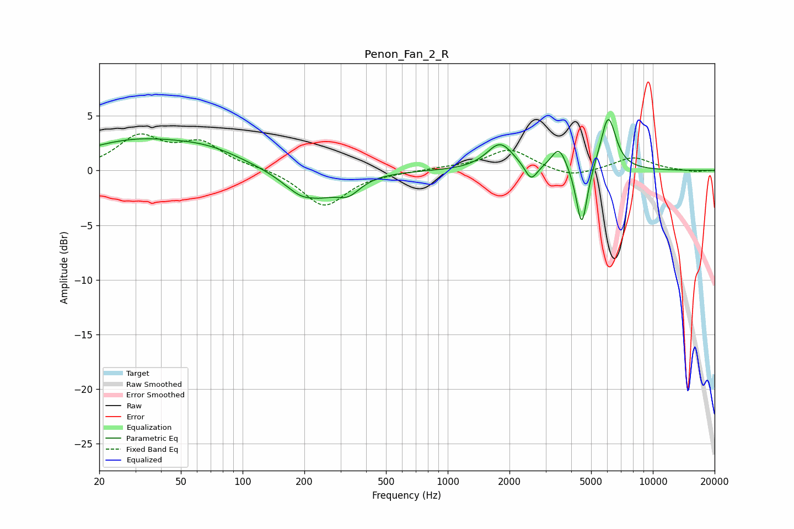

# Penon_Fan_2_R
See [usage instructions](https://github.com/jaakkopasanen/AutoEq#usage) for more options and info.

### Parametric EQs
Apply preamp of -4.8 dB when using parametric equalizer.

|   # | Type    |   Fc (Hz) |    Q |   Gain (dB) |
|-----|---------|-----------|------|-------------|
|   1 | Peaking |        30 | 0.51 |         2.6 |
|   2 | Peaking |        69 | 0.81 |         1.1 |
|   3 | Peaking |       211 | 1.36 |        -3.1 |
|   4 | Peaking |       217 | 2.85 |         0.5 |
|   5 | Peaking |       327 | 2.36 |        -1.4 |
|   6 | Peaking |      1800 | 2.18 |         2.4 |
|   7 | Peaking |      2549 | 4.77 |        -1.5 |
|   8 | Peaking |      3487 | 3.87 |         2.1 |
|   9 | Peaking |      4502 | 5.24 |        -5.7 |
|  10 | Peaking |      6058 | 3.7  |         5   |

### Fixed Band EQs
When using fixed band (also called graphic) equalizer, apply preamp of **-3.4 dB** (if available) and set gains manually with these parameters.

|   # | Type    |   Fc (Hz) |    Q |   Gain (dB) |
|-----|---------|-----------|------|-------------|
|   1 | Peaking |        31 | 1.41 |         2.9 |
|   2 | Peaking |        62 | 1.41 |         2.3 |
|   3 | Peaking |       125 | 1.41 |         0.2 |
|   4 | Peaking |       250 | 1.41 |        -3.3 |
|   5 | Peaking |       500 | 1.41 |        -0.1 |
|   6 | Peaking |      1000 | 1.41 |         0.2 |
|   7 | Peaking |      2000 | 1.41 |         1.9 |
|   8 | Peaking |      4000 | 1.41 |        -0.7 |
|   9 | Peaking |      8000 | 1.41 |         1.2 |
|  10 | Peaking |     16000 | 1.41 |        -0.1 |

### Graphs

