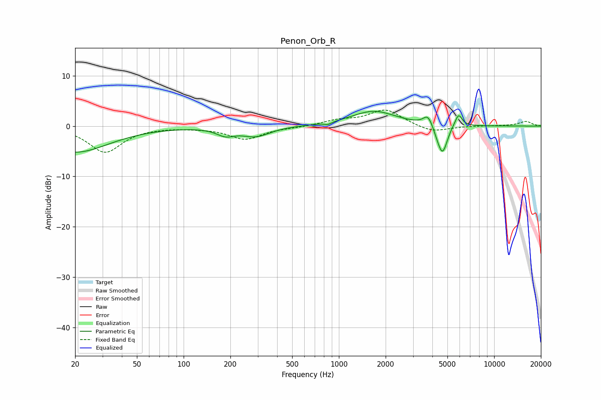

# Penon_Orb_R
See [usage instructions](https://github.com/jaakkopasanen/AutoEq#usage) for more options and info.

### Parametric EQs
Apply preamp of -3.0 dB when using parametric equalizer.

|   # | Type    |   Fc (Hz) |    Q |   Gain (dB) |
|-----|---------|-----------|------|-------------|
|   1 | Peaking |        20 | 0.65 |        -5.2 |
|   2 | Peaking |       186 | 2.44 |        -1.4 |
|   3 | Peaking |       292 | 1.55 |        -1.9 |
|   4 | Peaking |       849 | 5.99 |        -0.5 |
|   5 | Peaking |      1673 | 0.99 |         3   |
|   6 | Peaking |      3742 | 4.82 |         2   |
|   7 | Peaking |      4284 | 5.97 |        -1   |
|   8 | Peaking |      4630 | 5.11 |        -5   |
|   9 | Peaking |      4914 | 5.94 |        -0.8 |
|  10 | Peaking |      5897 | 6    |         2.5 |

### Fixed Band EQs
When using fixed band (also called graphic) equalizer, apply preamp of **-3.3 dB** (if available) and set gains manually with these parameters.

|   # | Type    |   Fc (Hz) |    Q |   Gain (dB) |
|-----|---------|-----------|------|-------------|
|   1 | Peaking |        31 | 1.41 |        -5.2 |
|   2 | Peaking |        62 | 1.41 |        -0.1 |
|   3 | Peaking |       125 | 1.41 |        -0.2 |
|   4 | Peaking |       250 | 1.41 |        -2.5 |
|   5 | Peaking |       500 | 1.41 |        -0.2 |
|   6 | Peaking |      1000 | 1.41 |         1   |
|   7 | Peaking |      2000 | 1.41 |         3.2 |
|   8 | Peaking |      4000 | 1.41 |        -1.3 |
|   9 | Peaking |      8000 | 1.41 |         0   |
|  10 | Peaking |     16000 | 1.41 |         0.9 |

### Graphs

