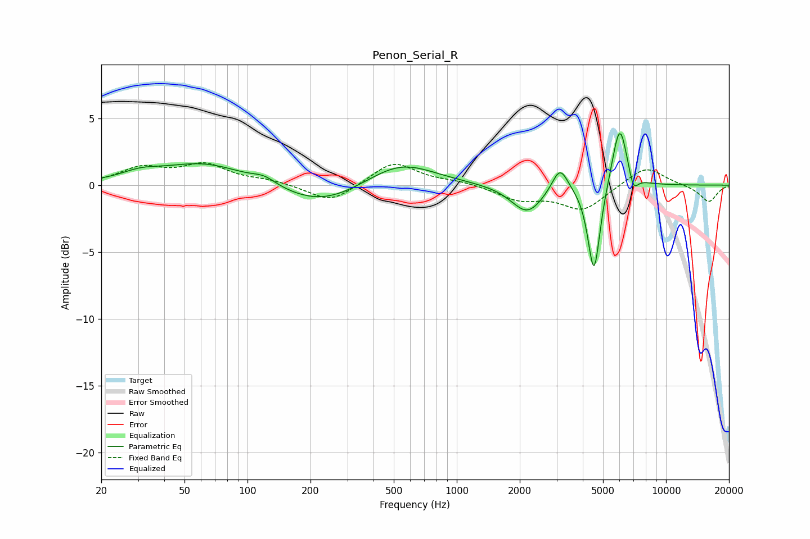

# Penon_Serial_R
See [usage instructions](https://github.com/jaakkopasanen/AutoEq#usage) for more options and info.

### Parametric EQs
Apply preamp of -4.0 dB when using parametric equalizer.

|   # | Type    |   Fc (Hz) |    Q |   Gain (dB) |
|-----|---------|-----------|------|-------------|
|   1 | Peaking |        31 | 1.52 |         0.6 |
|   2 | Peaking |        62 | 0.69 |         1.7 |
|   3 | Peaking |       120 | 2.55 |         0.5 |
|   4 | Peaking |       225 | 0.73 |        -1.6 |
|   5 | Peaking |       538 | 0.87 |         1.8 |
|   6 | Peaking |      2172 | 1.87 |        -2.1 |
|   7 | Peaking |      3113 | 3.73 |         1.9 |
|   8 | Peaking |      4528 | 4.77 |        -6.8 |
|   9 | Peaking |      6011 | 3.8  |         4.9 |
|  10 | Peaking |      6972 | 5.95 |        -1.4 |

### Fixed Band EQs
When using fixed band (also called graphic) equalizer, apply preamp of **-1.8 dB** (if available) and set gains manually with these parameters.

|   # | Type    |   Fc (Hz) |    Q |   Gain (dB) |
|-----|---------|-----------|------|-------------|
|   1 | Peaking |        31 | 1.41 |         1.2 |
|   2 | Peaking |        62 | 1.41 |         1.4 |
|   3 | Peaking |       125 | 1.41 |         0.3 |
|   4 | Peaking |       250 | 1.41 |        -1.4 |
|   5 | Peaking |       500 | 1.41 |         1.8 |
|   6 | Peaking |      1000 | 1.41 |         0.3 |
|   7 | Peaking |      2000 | 1.41 |        -1   |
|   8 | Peaking |      4000 | 1.41 |        -1.8 |
|   9 | Peaking |      8000 | 1.41 |         1.5 |
|  10 | Peaking |     16000 | 1.41 |        -1.3 |

### Graphs

