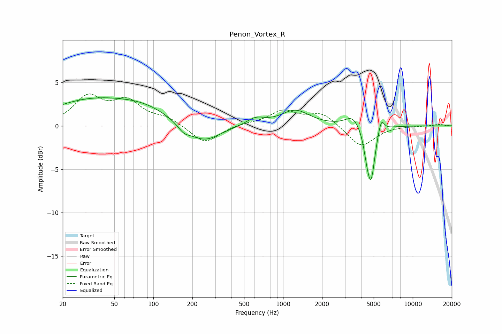

# Penon_Vortex_R
See [usage instructions](https://github.com/jaakkopasanen/AutoEq#usage) for more options and info.

### Parametric EQs
Apply preamp of -3.3 dB when using parametric equalizer.

|   # | Type    |   Fc (Hz) |    Q |   Gain (dB) |
|-----|---------|-----------|------|-------------|
|   1 | Peaking |        33 | 0.43 |         2.8 |
|   2 | Peaking |        88 | 0.71 |         1.3 |
|   3 | Peaking |       172 | 2.89 |        -0.8 |
|   4 | Peaking |       245 | 1.14 |        -2.1 |
|   5 | Peaking |       614 | 2.02 |         0.8 |
|   6 | Peaking |      1243 | 1.31 |         1.8 |
|   7 | Peaking |      3436 | 2.53 |         1.2 |
|   8 | Peaking |      4399 | 6    |        -1.5 |
|   9 | Peaking |      4765 | 4.63 |        -6.1 |
|  10 | Peaking |      5707 | 6    |         1.6 |

### Fixed Band EQs
When using fixed band (also called graphic) equalizer, apply preamp of **-3.8 dB** (if available) and set gains manually with these parameters.

|   # | Type    |   Fc (Hz) |    Q |   Gain (dB) |
|-----|---------|-----------|------|-------------|
|   1 | Peaking |        31 | 1.41 |         3.2 |
|   2 | Peaking |        62 | 1.41 |         2.6 |
|   3 | Peaking |       125 | 1.41 |         0.8 |
|   4 | Peaking |       250 | 1.41 |        -2.1 |
|   5 | Peaking |       500 | 1.41 |         0.2 |
|   6 | Peaking |      1000 | 1.41 |         1.7 |
|   7 | Peaking |      2000 | 1.41 |         1.5 |
|   8 | Peaking |      4000 | 1.41 |        -2.5 |
|   9 | Peaking |      8000 | 1.41 |         0   |
|  10 | Peaking |     16000 | 1.41 |         0.2 |

### Graphs

