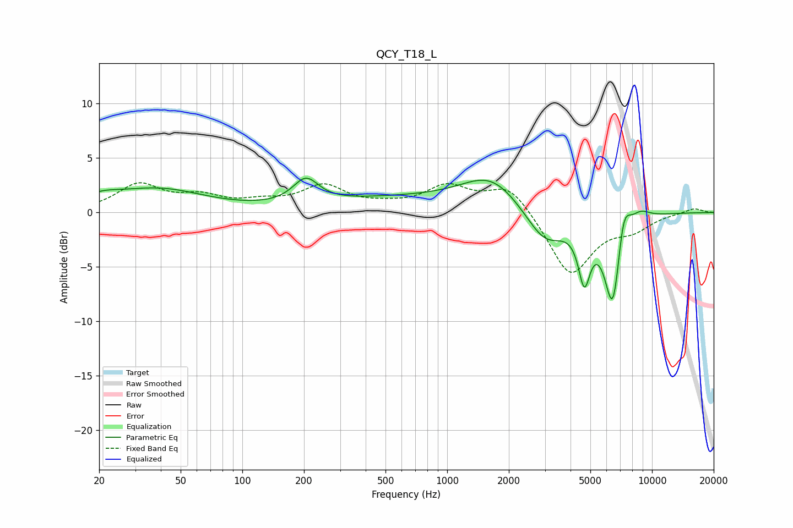

# QCY_T18_L
See [usage instructions](https://github.com/jaakkopasanen/AutoEq#usage) for more options and info.

### Parametric EQs
Apply preamp of -3.2 dB when using parametric equalizer.

|   # | Type    |   Fc (Hz) |    Q |   Gain (dB) |
|-----|---------|-----------|------|-------------|
|   1 | Peaking |        20 | 1.49 |         0.8 |
|   2 | Peaking |        39 | 0.63 |         2   |
|   3 | Peaking |       204 | 2.27 |         2.3 |
|   4 | Peaking |       577 | 0.38 |         1.2 |
|   5 | Peaking |      1649 | 0.98 |         3   |
|   6 | Peaking |      3004 | 1.43 |        -3.3 |
|   7 | Peaking |      4671 | 4.78 |        -5   |
|   8 | Peaking |      6448 | 3.26 |        -9   |
|   9 | Peaking |      7242 | 4.12 |         3.8 |
|  10 | Peaking |      8766 | 2.8  |         0.8 |

### Fixed Band EQs
When using fixed band (also called graphic) equalizer, apply preamp of **-2.8 dB** (if available) and set gains manually with these parameters.

|   # | Type    |   Fc (Hz) |    Q |   Gain (dB) |
|-----|---------|-----------|------|-------------|
|   1 | Peaking |        31 | 1.41 |         2.5 |
|   2 | Peaking |        62 | 1.41 |         1.2 |
|   3 | Peaking |       125 | 1.41 |         0.7 |
|   4 | Peaking |       250 | 1.41 |         2.3 |
|   5 | Peaking |       500 | 1.41 |         0.4 |
|   6 | Peaking |      1000 | 1.41 |         2.2 |
|   7 | Peaking |      2000 | 1.41 |         2.6 |
|   8 | Peaking |      4000 | 1.41 |        -5.8 |
|   9 | Peaking |      8000 | 1.41 |        -1.3 |
|  10 | Peaking |     16000 | 1.41 |         0.4 |

### Graphs

