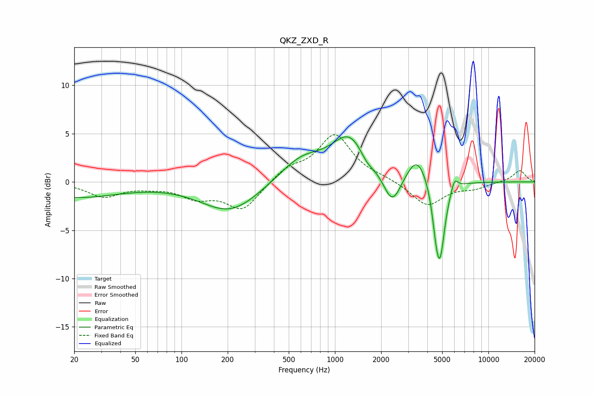

# QKZ_ZXD_R
See [usage instructions](https://github.com/jaakkopasanen/AutoEq#usage) for more options and info.

### Parametric EQs
Apply preamp of -4.8 dB when using parametric equalizer.

|   # | Type    |   Fc (Hz) |    Q |   Gain (dB) |
|-----|---------|-----------|------|-------------|
|   1 | Peaking |        20 | 0.47 |        -1.6 |
|   2 | Peaking |       208 | 0.74 |        -3.1 |
|   3 | Peaking |       605 | 0.96 |         2.4 |
|   4 | Peaking |      1254 | 1.21 |         4.5 |
|   5 | Peaking |      1611 | 3.03 |        -0.9 |
|   6 | Peaking |      2362 | 2.47 |        -3.3 |
|   7 | Peaking |      3441 | 2.09 |         2.9 |
|   8 | Peaking |      4527 | 6    |        -1.7 |
|   9 | Peaking |      4826 | 4.22 |        -7.9 |
|  10 | Peaking |      6004 | 6    |         1.3 |

### Fixed Band EQs
When using fixed band (also called graphic) equalizer, apply preamp of **-5.0 dB** (if available) and set gains manually with these parameters.

|   # | Type    |   Fc (Hz) |    Q |   Gain (dB) |
|-----|---------|-----------|------|-------------|
|   1 | Peaking |        31 | 1.41 |        -1.5 |
|   2 | Peaking |        62 | 1.41 |        -0.4 |
|   3 | Peaking |       125 | 1.41 |        -1.4 |
|   4 | Peaking |       250 | 1.41 |        -2.9 |
|   5 | Peaking |       500 | 1.41 |         1.3 |
|   6 | Peaking |      1000 | 1.41 |         4.8 |
|   7 | Peaking |      2000 | 1.41 |         0.3 |
|   8 | Peaking |      4000 | 1.41 |        -2.5 |
|   9 | Peaking |      8000 | 1.41 |        -0.6 |
|  10 | Peaking |     16000 | 1.41 |         1.2 |

### Graphs

