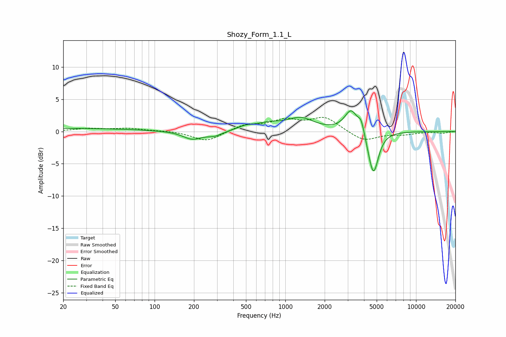

# Shozy_Form_1.1_L
See [usage instructions](https://github.com/jaakkopasanen/AutoEq#usage) for more options and info.

### Parametric EQs
Apply preamp of -3.3 dB when using parametric equalizer.

|   # | Type    |   Fc (Hz) |    Q |   Gain (dB) |
|-----|---------|-----------|------|-------------|
|   1 | Peaking |        20 | 0.23 |         0.5 |
|   2 | Peaking |       195 | 1.94 |        -1.2 |
|   3 | Peaking |       288 | 2.5  |        -0.6 |
|   4 | Peaking |       499 | 2.24 |         0.6 |
|   5 | Peaking |       744 | 1.47 |         1   |
|   6 | Peaking |      1308 | 1.38 |         1.9 |
|   7 | Peaking |      3189 | 2.85 |         3.4 |
|   8 | Peaking |      3806 | 5.98 |         1.8 |
|   9 | Peaking |      4517 | 3.4  |        -1.1 |
|  10 | Peaking |      4739 | 3.71 |        -5.9 |

### Fixed Band EQs
When using fixed band (also called graphic) equalizer, apply preamp of **-2.3 dB** (if available) and set gains manually with these parameters.

|   # | Type    |   Fc (Hz) |    Q |   Gain (dB) |
|-----|---------|-----------|------|-------------|
|   1 | Peaking |        31 | 1.41 |         0.4 |
|   2 | Peaking |        62 | 1.41 |         0.5 |
|   3 | Peaking |       125 | 1.41 |         0.1 |
|   4 | Peaking |       250 | 1.41 |        -1.6 |
|   5 | Peaking |       500 | 1.41 |         1   |
|   6 | Peaking |      1000 | 1.41 |         1.6 |
|   7 | Peaking |      2000 | 1.41 |         2.1 |
|   8 | Peaking |      4000 | 1.41 |        -1.5 |
|   9 | Peaking |      8000 | 1.41 |        -0.4 |
|  10 | Peaking |     16000 | 1.41 |        -0.2 |

### Graphs

