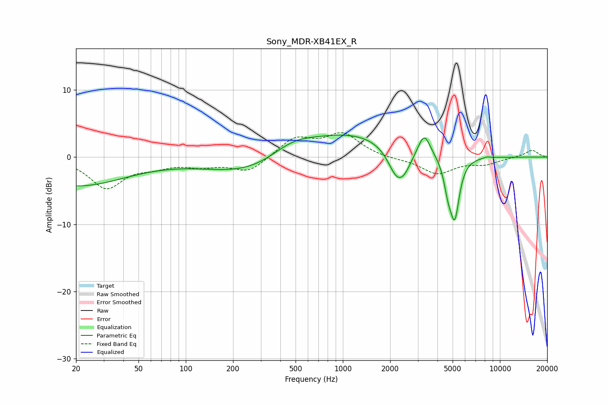

# Sony_MDR-XB41EX_R
See [usage instructions](https://github.com/jaakkopasanen/AutoEq#usage) for more options and info.

### Parametric EQs
Apply preamp of -3.4 dB when using parametric equalizer.

|   # | Type    |   Fc (Hz) |    Q |   Gain (dB) |
|-----|---------|-----------|------|-------------|
|   1 | Peaking |        20 | 0.44 |        -4.2 |
|   2 | Peaking |       340 | 0.44 |        -3.8 |
|   3 | Peaking |       472 | 0.87 |         3.3 |
|   4 | Peaking |      1046 | 0.46 |         4.1 |
|   5 | Peaking |      2199 | 2.47 |        -4.1 |
|   6 | Peaking |      2470 | 2.99 |        -1.9 |
|   7 | Peaking |      3296 | 3.7  |         3.3 |
|   8 | Peaking |      4682 | 5.23 |        -3.5 |
|   9 | Peaking |      5165 | 4.71 |        -8.4 |
|  10 | Peaking |      8269 | 5.95 |         0.2 |

### Fixed Band EQs
When using fixed band (also called graphic) equalizer, apply preamp of **-3.7 dB** (if available) and set gains manually with these parameters.

|   # | Type    |   Fc (Hz) |    Q |   Gain (dB) |
|-----|---------|-----------|------|-------------|
|   1 | Peaking |        31 | 1.41 |        -4.5 |
|   2 | Peaking |        62 | 1.41 |        -1.1 |
|   3 | Peaking |       125 | 1.41 |        -1.1 |
|   4 | Peaking |       250 | 1.41 |        -2.2 |
|   5 | Peaking |       500 | 1.41 |         2.8 |
|   6 | Peaking |      1000 | 1.41 |         3.3 |
|   7 | Peaking |      2000 | 1.41 |        -0.3 |
|   8 | Peaking |      4000 | 1.41 |        -2.4 |
|   9 | Peaking |      8000 | 1.41 |        -0.9 |
|  10 | Peaking |     16000 | 1.41 |         1.1 |

### Graphs

