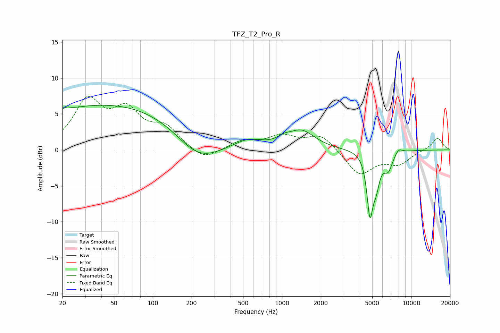

# TFZ_T2_Pro_R
See [usage instructions](https://github.com/jaakkopasanen/AutoEq#usage) for more options and info.

### Parametric EQs
Apply preamp of -6.3 dB when using parametric equalizer.

|   # | Type    |   Fc (Hz) |    Q |   Gain (dB) |
|-----|---------|-----------|------|-------------|
|   1 | Peaking |        21 | 5.4  |         0.4 |
|   2 | Peaking |        49 | 0.21 |         6.5 |
|   3 | Peaking |       224 | 0.8  |        -4   |
|   4 | Peaking |       545 | 1.32 |         1.2 |
|   5 | Peaking |      1034 | 2.96 |         0.6 |
|   6 | Peaking |      1414 | 1.38 |         2.5 |
|   7 | Peaking |      4796 | 5.98 |        -7.9 |
|   8 | Peaking |      5360 | 4.94 |        -3.5 |
|   9 | Peaking |      6641 | 3.77 |        -2.4 |
|  10 | Peaking |      7981 | 4.38 |         0.8 |

### Fixed Band EQs
When using fixed band (also called graphic) equalizer, apply preamp of **-7.6 dB** (if available) and set gains manually with these parameters.

|   # | Type    |   Fc (Hz) |    Q |   Gain (dB) |
|-----|---------|-----------|------|-------------|
|   1 | Peaking |        31 | 1.41 |         6.5 |
|   2 | Peaking |        62 | 1.41 |         4.7 |
|   3 | Peaking |       125 | 1.41 |         2.8 |
|   4 | Peaking |       250 | 1.41 |        -1.7 |
|   5 | Peaking |       500 | 1.41 |         1.2 |
|   6 | Peaking |      1000 | 1.41 |         1.8 |
|   7 | Peaking |      2000 | 1.41 |         2.1 |
|   8 | Peaking |      4000 | 1.41 |        -3.5 |
|   9 | Peaking |      8000 | 1.41 |        -1.8 |
|  10 | Peaking |     16000 | 1.41 |         1.7 |

### Graphs

