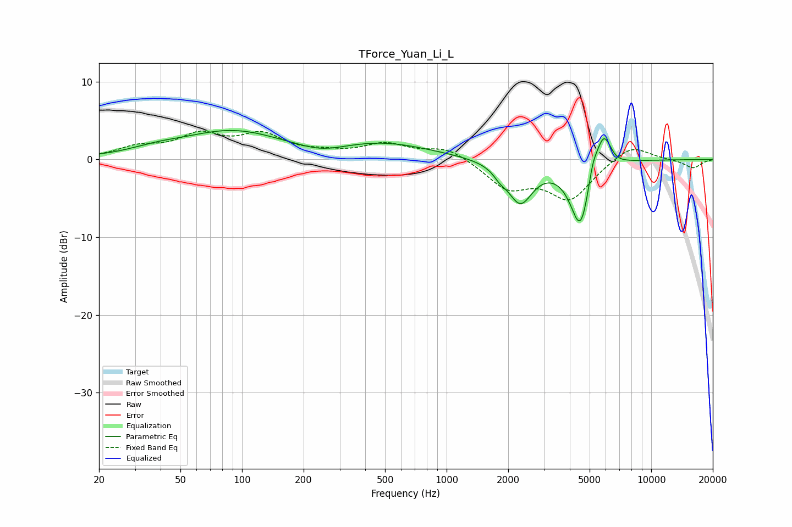

# TForce_Yuan_Li_L
See [usage instructions](https://github.com/jaakkopasanen/AutoEq#usage) for more options and info.

### Parametric EQs
Apply preamp of -3.8 dB when using parametric equalizer.

|   # | Type    |   Fc (Hz) |    Q |   Gain (dB) |
|-----|---------|-----------|------|-------------|
|   1 | Peaking |        38 | 1.15 |         0.6 |
|   2 | Peaking |        89 | 0.58 |         3.5 |
|   3 | Peaking |       244 | 1.25 |        -0.9 |
|   4 | Peaking |       490 | 0.59 |         2   |
|   5 | Peaking |      1825 | 4.64 |        -0.8 |
|   6 | Peaking |      2290 | 2.28 |        -5.3 |
|   7 | Peaking |      4517 | 2.78 |        -9   |
|   8 | Peaking |      5174 | 6    |         2.2 |
|   9 | Peaking |      5847 | 3.47 |         5.1 |
|  10 | Peaking |      6698 | 3.59 |        -0.4 |

### Fixed Band EQs
When using fixed band (also called graphic) equalizer, apply preamp of **-3.7 dB** (if available) and set gains manually with these parameters.

|   # | Type    |   Fc (Hz) |    Q |   Gain (dB) |
|-----|---------|-----------|------|-------------|
|   1 | Peaking |        31 | 1.41 |         1.4 |
|   2 | Peaking |        62 | 1.41 |         2.8 |
|   3 | Peaking |       125 | 1.41 |         2.8 |
|   4 | Peaking |       250 | 1.41 |         0.6 |
|   5 | Peaking |       500 | 1.41 |         1.8 |
|   6 | Peaking |      1000 | 1.41 |         1.6 |
|   7 | Peaking |      2000 | 1.41 |        -3.5 |
|   8 | Peaking |      4000 | 1.41 |        -4.9 |
|   9 | Peaking |      8000 | 1.41 |         2.1 |
|  10 | Peaking |     16000 | 1.41 |        -1.1 |

### Graphs

