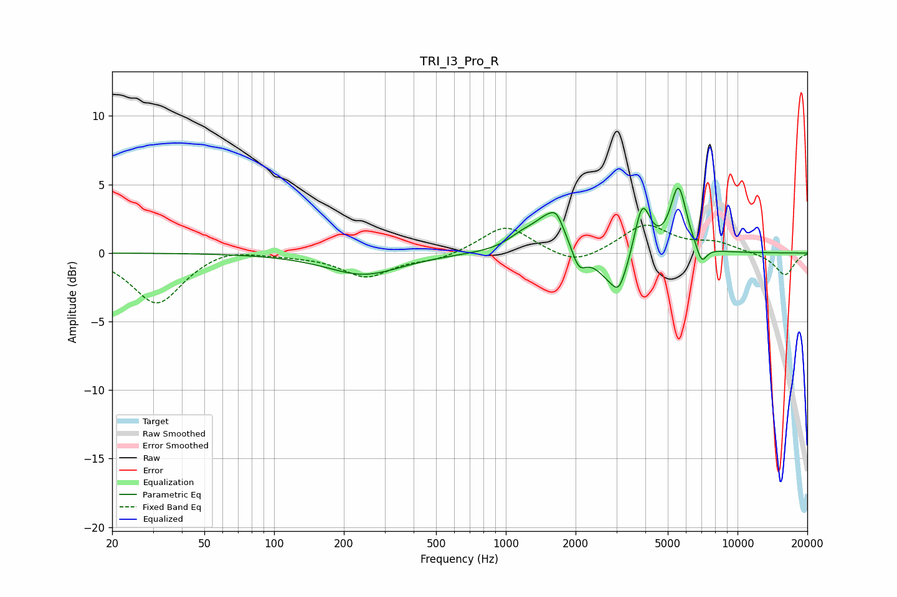

# TRI_I3_Pro_R
See [usage instructions](https://github.com/jaakkopasanen/AutoEq#usage) for more options and info.

### Parametric EQs
Apply preamp of -4.8 dB when using parametric equalizer.

|   # | Type    |   Fc (Hz) |    Q |   Gain (dB) |
|-----|---------|-----------|------|-------------|
|   1 | Peaking |       244 | 0.88 |        -1.6 |
|   2 | Peaking |      1171 | 2.21 |         0.7 |
|   3 | Peaking |      1571 | 1.94 |         2.8 |
|   4 | Peaking |      1657 | 6    |         0.6 |
|   5 | Peaking |      2062 | 4.49 |        -1.6 |
|   6 | Peaking |      3019 | 1.93 |        -3   |
|   7 | Peaking |      3076 | 6    |        -0.8 |
|   8 | Peaking |      3873 | 3.92 |         4.2 |
|   9 | Peaking |      5557 | 3.95 |         4.8 |
|  10 | Peaking |      6994 | 6    |        -1.3 |

### Fixed Band EQs
When using fixed band (also called graphic) equalizer, apply preamp of **-2.1 dB** (if available) and set gains manually with these parameters.

|   # | Type    |   Fc (Hz) |    Q |   Gain (dB) |
|-----|---------|-----------|------|-------------|
|   1 | Peaking |        31 | 1.41 |        -3.7 |
|   2 | Peaking |        62 | 1.41 |         0.5 |
|   3 | Peaking |       125 | 1.41 |        -0.1 |
|   4 | Peaking |       250 | 1.41 |        -1.7 |
|   5 | Peaking |       500 | 1.41 |        -0.5 |
|   6 | Peaking |      1000 | 1.41 |         2.1 |
|   7 | Peaking |      2000 | 1.41 |        -1   |
|   8 | Peaking |      4000 | 1.41 |         2.1 |
|   9 | Peaking |      8000 | 1.41 |         0.7 |
|  10 | Peaking |     16000 | 1.41 |        -1.6 |

### Graphs

