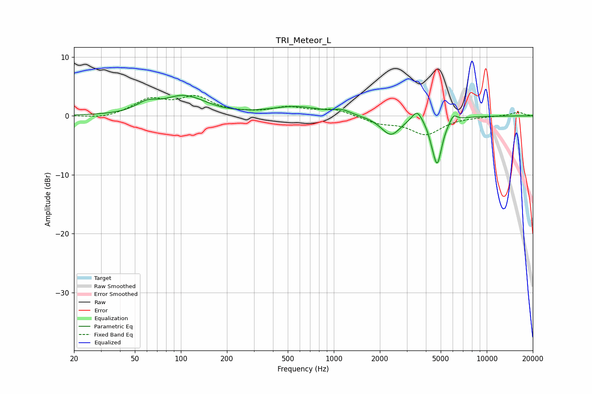

# TRI_Meteor_L
See [usage instructions](https://github.com/jaakkopasanen/AutoEq#usage) for more options and info.

### Parametric EQs
Apply preamp of -3.6 dB when using parametric equalizer.

|   # | Type    |   Fc (Hz) |    Q |   Gain (dB) |
|-----|---------|-----------|------|-------------|
|   1 | Peaking |        60 | 2.05 |         1.5 |
|   2 | Peaking |       107 | 1.1  |         3.5 |
|   3 | Peaking |       111 | 2.11 |        -0.3 |
|   4 | Peaking |       561 | 0.89 |         1.5 |
|   5 | Peaking |      1126 | 2.58 |         0.8 |
|   6 | Peaking |      2357 | 2.22 |        -3.3 |
|   7 | Peaking |      3505 | 4.16 |         2.1 |
|   8 | Peaking |      4384 | 5.67 |        -0.8 |
|   9 | Peaking |      4745 | 4.45 |        -7.7 |
|  10 | Peaking |      6061 | 6    |         1.2 |

### Fixed Band EQs
When using fixed band (also called graphic) equalizer, apply preamp of **-3.5 dB** (if available) and set gains manually with these parameters.

|   # | Type    |   Fc (Hz) |    Q |   Gain (dB) |
|-----|---------|-----------|------|-------------|
|   1 | Peaking |        31 | 1.41 |        -0.5 |
|   2 | Peaking |        62 | 1.41 |         2.6 |
|   3 | Peaking |       125 | 1.41 |         2.9 |
|   4 | Peaking |       250 | 1.41 |         0.2 |
|   5 | Peaking |       500 | 1.41 |         1.3 |
|   6 | Peaking |      1000 | 1.41 |         1.1 |
|   7 | Peaking |      2000 | 1.41 |        -1.1 |
|   8 | Peaking |      4000 | 1.41 |        -3   |
|   9 | Peaking |      8000 | 1.41 |        -0.1 |
|  10 | Peaking |     16000 | 1.41 |         0.6 |

### Graphs

