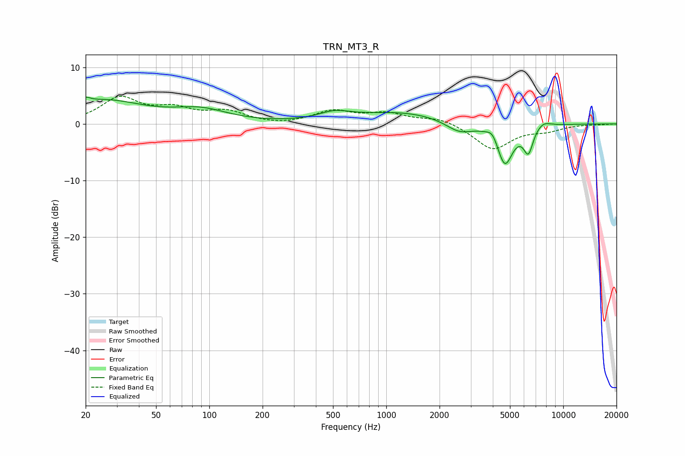

# TRN_MT3_R
See [usage instructions](https://github.com/jaakkopasanen/AutoEq#usage) for more options and info.

### Parametric EQs
Apply preamp of -4.8 dB when using parametric equalizer.

|   # | Type    |   Fc (Hz) |    Q |   Gain (dB) |
|-----|---------|-----------|------|-------------|
|   1 | Peaking |        20 | 5.85 |         0.8 |
|   2 | Peaking |        25 | 0.6  |         4   |
|   3 | Peaking |        90 | 0.93 |         2.1 |
|   4 | Peaking |       510 | 1.58 |         1.3 |
|   5 | Peaking |      1236 | 0.53 |         2   |
|   6 | Peaking |      2589 | 1.77 |        -2.1 |
|   7 | Peaking |      3987 | 4.81 |         1.5 |
|   8 | Peaking |      4680 | 3.07 |        -7.2 |
|   9 | Peaking |      6355 | 5.04 |        -4.4 |
|  10 | Peaking |      7679 | 3.22 |         1   |

### Fixed Band EQs
When using fixed band (also called graphic) equalizer, apply preamp of **-5.0 dB** (if available) and set gains manually with these parameters.

|   # | Type    |   Fc (Hz) |    Q |   Gain (dB) |
|-----|---------|-----------|------|-------------|
|   1 | Peaking |        31 | 1.41 |         4.4 |
|   2 | Peaking |        62 | 1.41 |         2.2 |
|   3 | Peaking |       125 | 1.41 |         2   |
|   4 | Peaking |       250 | 1.41 |        -0.3 |
|   5 | Peaking |       500 | 1.41 |         2.2 |
|   6 | Peaking |      1000 | 1.41 |         1.7 |
|   7 | Peaking |      2000 | 1.41 |         1.1 |
|   8 | Peaking |      4000 | 1.41 |        -4.5 |
|   9 | Peaking |      8000 | 1.41 |        -1   |
|  10 | Peaking |     16000 | 1.41 |        -0.1 |

### Graphs

