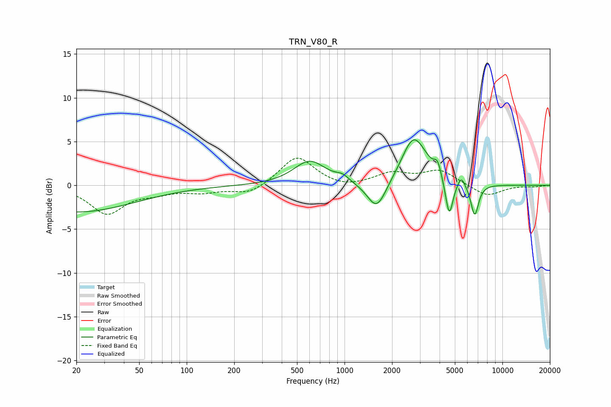

# TRN_V80_R
See [usage instructions](https://github.com/jaakkopasanen/AutoEq#usage) for more options and info.

### Parametric EQs
Apply preamp of -5.3 dB when using parametric equalizer.

|   # | Type    |   Fc (Hz) |    Q |   Gain (dB) |
|-----|---------|-----------|------|-------------|
|   1 | Peaking |        20 | 0.39 |        -3   |
|   2 | Peaking |       602 | 1.4  |         2.8 |
|   3 | Peaking |       971 | 3.42 |         0.6 |
|   4 | Peaking |      1600 | 2.32 |        -3.4 |
|   5 | Peaking |      2728 | 1.87 |         5.3 |
|   6 | Peaking |      3238 | 2.47 |         0.5 |
|   7 | Peaking |      3886 | 5.99 |         1.6 |
|   8 | Peaking |      4607 | 5.87 |        -4.3 |
|   9 | Peaking |      5488 | 6    |         1.2 |
|  10 | Peaking |      6678 | 5.62 |        -3.6 |

### Fixed Band EQs
When using fixed band (also called graphic) equalizer, apply preamp of **-3.2 dB** (if available) and set gains manually with these parameters.

|   # | Type    |   Fc (Hz) |    Q |   Gain (dB) |
|-----|---------|-----------|------|-------------|
|   1 | Peaking |        31 | 1.41 |        -3.2 |
|   2 | Peaking |        62 | 1.41 |        -0.7 |
|   3 | Peaking |       125 | 1.41 |        -0.7 |
|   4 | Peaking |       250 | 1.41 |        -1.1 |
|   5 | Peaking |       500 | 1.41 |         3.3 |
|   6 | Peaking |      1000 | 1.41 |        -0.4 |
|   7 | Peaking |      2000 | 1.41 |         1.3 |
|   8 | Peaking |      4000 | 1.41 |         1.7 |
|   9 | Peaking |      8000 | 1.41 |        -1.3 |
|  10 | Peaking |     16000 | 1.41 |        -0.1 |

### Graphs

