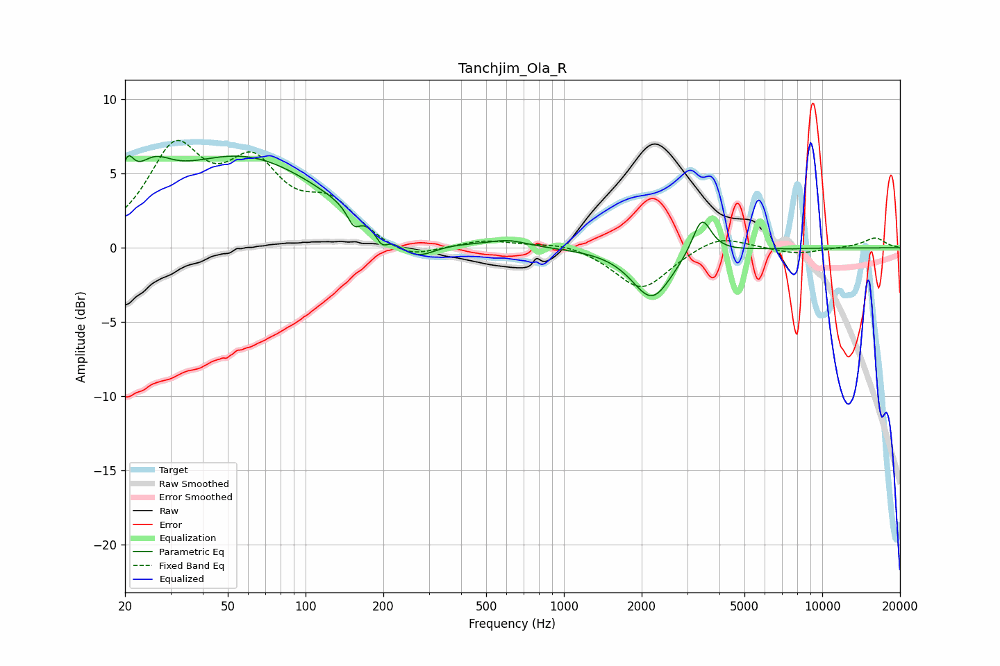

# Tanchjim_Ola_R
See [usage instructions](https://github.com/jaakkopasanen/AutoEq#usage) for more options and info.

### Parametric EQs
Apply preamp of -6.3 dB when using parametric equalizer.

|   # | Type    |   Fc (Hz) |    Q |   Gain (dB) |
|-----|---------|-----------|------|-------------|
|   1 | Peaking |        20 | 5.87 |         2.1 |
|   2 | Peaking |        26 | 1.98 |         2.1 |
|   3 | Peaking |        57 | 0.44 |         6   |
|   4 | Peaking |       154 | 5.74 |        -1.1 |
|   5 | Peaking |       197 | 5.84 |        -1   |
|   6 | Peaking |       265 | 1.8  |        -1.7 |
|   7 | Peaking |       610 | 2.01 |         0.4 |
|   8 | Peaking |      2192 | 1.84 |        -3.4 |
|   9 | Peaking |      3418 | 3.89 |         2.6 |
|  10 | Peaking |      7679 | 6    |        -0   |

### Fixed Band EQs
When using fixed band (also called graphic) equalizer, apply preamp of **-7.3 dB** (if available) and set gains manually with these parameters.

|   # | Type    |   Fc (Hz) |    Q |   Gain (dB) |
|-----|---------|-----------|------|-------------|
|   1 | Peaking |        31 | 1.41 |         6.2 |
|   2 | Peaking |        62 | 1.41 |         4.8 |
|   3 | Peaking |       125 | 1.41 |         2.6 |
|   4 | Peaking |       250 | 1.41 |        -1   |
|   5 | Peaking |       500 | 1.41 |         0.5 |
|   6 | Peaking |      1000 | 1.41 |         0.4 |
|   7 | Peaking |      2000 | 1.41 |        -2.9 |
|   8 | Peaking |      4000 | 1.41 |         1   |
|   9 | Peaking |      8000 | 1.41 |        -0.4 |
|  10 | Peaking |     16000 | 1.41 |         0.7 |

### Graphs

