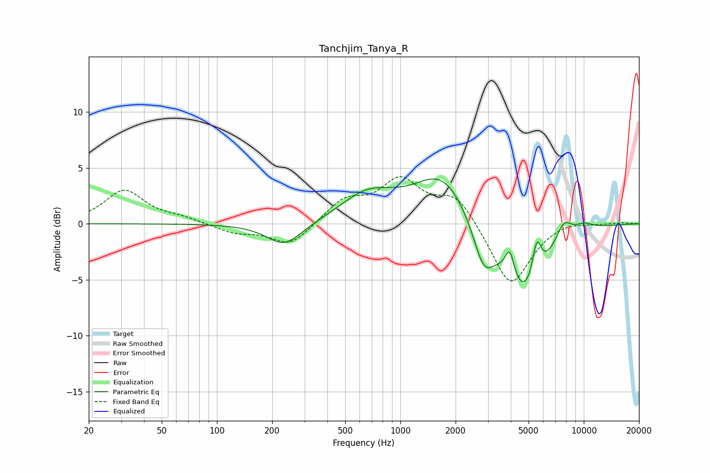

# Tanchjim_Tanya_R
See [usage instructions](https://github.com/jaakkopasanen/AutoEq#usage) for more options and info.

### Parametric EQs
Apply preamp of -4.1 dB when using parametric equalizer.

|   # | Type    |   Fc (Hz) |    Q |   Gain (dB) |
|-----|---------|-----------|------|-------------|
|   1 | Peaking |       233 | 1.46 |        -2.1 |
|   2 | Peaking |       606 | 1.19 |         0.7 |
|   3 | Peaking |       706 | 0.91 |         1.8 |
|   4 | Peaking |      1695 | 0.94 |         4.4 |
|   5 | Peaking |      2842 | 2.49 |        -3.7 |
|   6 | Peaking |      3950 | 5.57 |         2.6 |
|   7 | Peaking |      4732 | 1.17 |        -6.8 |
|   8 | Peaking |      5545 | 5.6  |         3.4 |
|   9 | Peaking |      7775 | 2.98 |         1.8 |
|  10 | Peaking |     10000 | 2.31 |         0.6 |

### Fixed Band EQs
When using fixed band (also called graphic) equalizer, apply preamp of **-4.3 dB** (if available) and set gains manually with these parameters.

|   # | Type    |   Fc (Hz) |    Q |   Gain (dB) |
|-----|---------|-----------|------|-------------|
|   1 | Peaking |        31 | 1.41 |         3   |
|   2 | Peaking |        62 | 1.41 |         0.4 |
|   3 | Peaking |       125 | 1.41 |        -0.8 |
|   4 | Peaking |       250 | 1.41 |        -2   |
|   5 | Peaking |       500 | 1.41 |         2   |
|   6 | Peaking |      1000 | 1.41 |         3.6 |
|   7 | Peaking |      2000 | 1.41 |         2.5 |
|   8 | Peaking |      4000 | 1.41 |        -5.7 |
|   9 | Peaking |      8000 | 1.41 |         0.4 |
|  10 | Peaking |     16000 | 1.41 |         0.1 |

### Graphs

