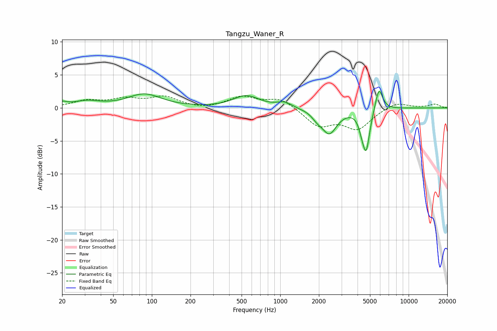

# Tangzu_Waner_R
See [usage instructions](https://github.com/jaakkopasanen/AutoEq#usage) for more options and info.

### Parametric EQs
Apply preamp of -2.6 dB when using parametric equalizer.

|   # | Type    |   Fc (Hz) |    Q |   Gain (dB) |
|-----|---------|-----------|------|-------------|
|   1 | Peaking |        20 | 3.77 |         0.6 |
|   2 | Peaking |        31 | 1.37 |         0.9 |
|   3 | Peaking |        88 | 1.08 |         2   |
|   4 | Peaking |       544 | 1.42 |         1.8 |
|   5 | Peaking |      1081 | 2.5  |         0.8 |
|   6 | Peaking |      1934 | 3.62 |        -0.8 |
|   7 | Peaking |      2409 | 2.37 |        -3.7 |
|   8 | Peaking |      4303 | 6    |        -1.2 |
|   9 | Peaking |      4667 | 4.98 |        -6.1 |
|  10 | Peaking |      5873 | 4.82 |         3.5 |

### Fixed Band EQs
When using fixed band (also called graphic) equalizer, apply preamp of **-1.9 dB** (if available) and set gains manually with these parameters.

|   # | Type    |   Fc (Hz) |    Q |   Gain (dB) |
|-----|---------|-----------|------|-------------|
|   1 | Peaking |        31 | 1.41 |         1   |
|   2 | Peaking |        62 | 1.41 |         1.2 |
|   3 | Peaking |       125 | 1.41 |         1.5 |
|   4 | Peaking |       250 | 1.41 |        -0.3 |
|   5 | Peaking |       500 | 1.41 |         1.6 |
|   6 | Peaking |      1000 | 1.41 |         1.5 |
|   7 | Peaking |      2000 | 1.41 |        -2.7 |
|   8 | Peaking |      4000 | 1.41 |        -3   |
|   9 | Peaking |      8000 | 1.41 |         1   |
|  10 | Peaking |     16000 | 1.41 |         0.6 |

### Graphs

