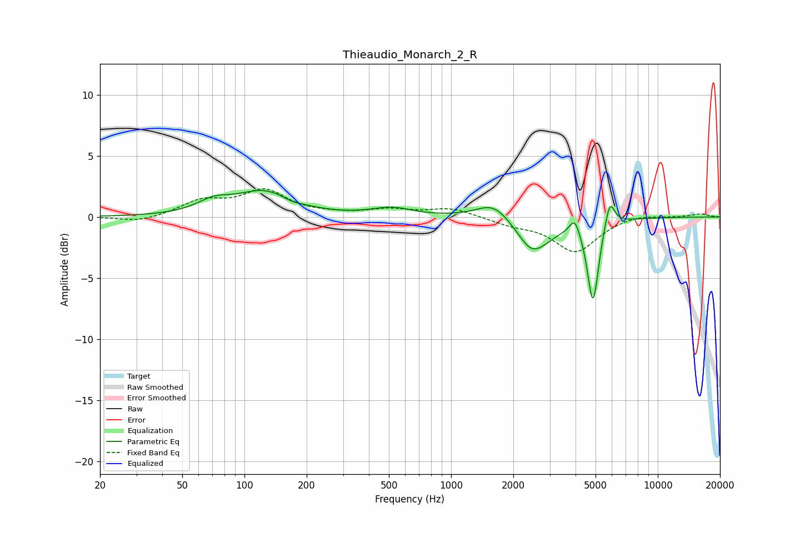

# Thieaudio_Monarch_2_R
See [usage instructions](https://github.com/jaakkopasanen/AutoEq#usage) for more options and info.

### Parametric EQs
Apply preamp of -2.3 dB when using parametric equalizer.

|   # | Type    |   Fc (Hz) |    Q |   Gain (dB) |
|-----|---------|-----------|------|-------------|
|   1 | Peaking |        71 | 1.72 |         0.9 |
|   2 | Peaking |       125 | 1.04 |         2   |
|   3 | Peaking |       169 | 3.21 |        -0.2 |
|   4 | Peaking |       516 | 1.46 |         0.7 |
|   5 | Peaking |      1618 | 1.67 |         1.5 |
|   6 | Peaking |      2412 | 3.28 |        -0.4 |
|   7 | Peaking |      2526 | 1.52 |        -2.6 |
|   8 | Peaking |      3963 | 6    |         1.3 |
|   9 | Peaking |      4858 | 5.19 |        -6.8 |
|  10 | Peaking |      5862 | 5.96 |         2.2 |

### Fixed Band EQs
When using fixed band (also called graphic) equalizer, apply preamp of **-2.4 dB** (if available) and set gains manually with these parameters.

|   # | Type    |   Fc (Hz) |    Q |   Gain (dB) |
|-----|---------|-----------|------|-------------|
|   1 | Peaking |        31 | 1.41 |        -0.5 |
|   2 | Peaking |        62 | 1.41 |         1.2 |
|   3 | Peaking |       125 | 1.41 |         2   |
|   4 | Peaking |       250 | 1.41 |         0.1 |
|   5 | Peaking |       500 | 1.41 |         0.5 |
|   6 | Peaking |      1000 | 1.41 |         0.7 |
|   7 | Peaking |      2000 | 1.41 |        -0.5 |
|   8 | Peaking |      4000 | 1.41 |        -2.8 |
|   9 | Peaking |      8000 | 1.41 |         0.3 |
|  10 | Peaking |     16000 | 1.41 |         0.3 |

### Graphs

