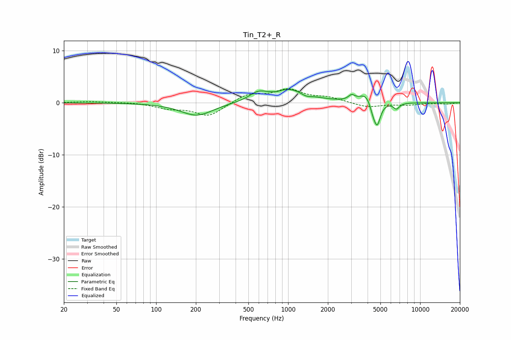

# Tin_T2+_R
See [usage instructions](https://github.com/jaakkopasanen/AutoEq#usage) for more options and info.

### Parametric EQs
Apply preamp of -2.7 dB when using parametric equalizer.

|   # | Type    |   Fc (Hz) |    Q |   Gain (dB) |
|-----|---------|-----------|------|-------------|
|   1 | Peaking |       204 | 1.16 |        -2.5 |
|   2 | Peaking |       591 | 2.22 |         1.3 |
|   3 | Peaking |       809 | 3.07 |        -0.4 |
|   4 | Peaking |       995 | 1    |         2.7 |
|   5 | Peaking |      1363 | 3.6  |        -0.6 |
|   6 | Peaking |      3026 | 6    |         0.9 |
|   7 | Peaking |      3902 | 2.78 |         1.9 |
|   8 | Peaking |      4381 | 6    |        -1.6 |
|   9 | Peaking |      4724 | 5.48 |        -4.4 |
|  10 | Peaking |      6614 | 6    |        -1.1 |

### Fixed Band EQs
When using fixed band (also called graphic) equalizer, apply preamp of **-2.8 dB** (if available) and set gains manually with these parameters.

|   # | Type    |   Fc (Hz) |    Q |   Gain (dB) |
|-----|---------|-----------|------|-------------|
|   1 | Peaking |        31 | 1.41 |         0.2 |
|   2 | Peaking |        62 | 1.41 |         0.1 |
|   3 | Peaking |       125 | 1.41 |        -1   |
|   4 | Peaking |       250 | 1.41 |        -2.6 |
|   5 | Peaking |       500 | 1.41 |         1.6 |
|   6 | Peaking |      1000 | 1.41 |         2.4 |
|   7 | Peaking |      2000 | 1.41 |         0.9 |
|   8 | Peaking |      4000 | 1.41 |        -0.9 |
|   9 | Peaking |      8000 | 1.41 |        -0.4 |
|  10 | Peaking |     16000 | 1.41 |        -0.2 |

### Graphs

