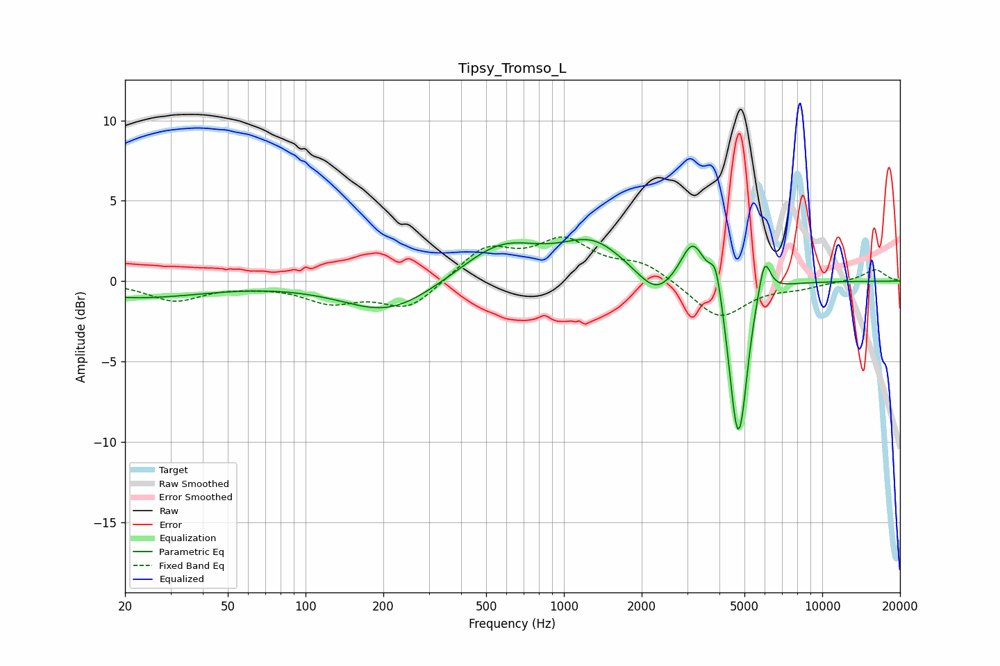

# Tipsy_Tromso_L
See [usage instructions](https://github.com/jaakkopasanen/AutoEq#usage) for more options and info.

### Parametric EQs
Apply preamp of -2.7 dB when using parametric equalizer.

|   # | Type    |   Fc (Hz) |    Q |   Gain (dB) |
|-----|---------|-----------|------|-------------|
|   1 | Peaking |        22 | 0.53 |        -1   |
|   2 | Peaking |       210 | 0.8  |        -2   |
|   3 | Peaking |       572 | 0.91 |         2.3 |
|   4 | Peaking |      1300 | 1.13 |         2.2 |
|   5 | Peaking |      2276 | 1.97 |        -1.5 |
|   6 | Peaking |      3155 | 2.99 |         2.8 |
|   7 | Peaking |      3877 | 5.99 |         2.1 |
|   8 | Peaking |      4682 | 4.1  |        -8.7 |
|   9 | Peaking |      4911 | 6    |        -1.9 |
|  10 | Peaking |      5974 | 5.88 |         2.5 |

### Fixed Band EQs
When using fixed band (also called graphic) equalizer, apply preamp of **-2.8 dB** (if available) and set gains manually with these parameters.

|   # | Type    |   Fc (Hz) |    Q |   Gain (dB) |
|-----|---------|-----------|------|-------------|
|   1 | Peaking |        31 | 1.41 |        -1.2 |
|   2 | Peaking |        62 | 1.41 |        -0.1 |
|   3 | Peaking |       125 | 1.41 |        -1.2 |
|   4 | Peaking |       250 | 1.41 |        -1.7 |
|   5 | Peaking |       500 | 1.41 |         2   |
|   6 | Peaking |      1000 | 1.41 |         2.3 |
|   7 | Peaking |      2000 | 1.41 |         1.1 |
|   8 | Peaking |      4000 | 1.41 |        -2.4 |
|   9 | Peaking |      8000 | 1.41 |        -0.3 |
|  10 | Peaking |     16000 | 1.41 |         0.7 |

### Graphs

