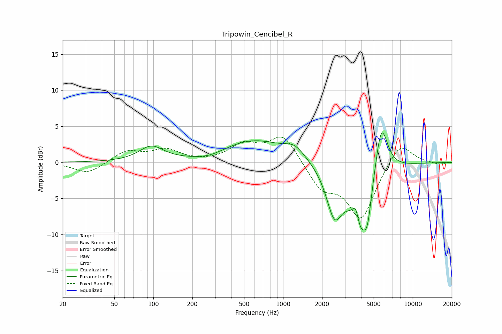

# Tripowin_Cencibel_R
See [usage instructions](https://github.com/jaakkopasanen/AutoEq#usage) for more options and info.

### Parametric EQs
Apply preamp of -4.2 dB when using parametric equalizer.

|   # | Type    |   Fc (Hz) |    Q |   Gain (dB) |
|-----|---------|-----------|------|-------------|
|   1 | Peaking |        96 | 1.5  |         2.1 |
|   2 | Peaking |       267 | 1.25 |        -0.7 |
|   3 | Peaking |       594 | 0.57 |         3.1 |
|   4 | Peaking |      1231 | 1.84 |         1.5 |
|   5 | Peaking |      2486 | 2.28 |        -6.4 |
|   6 | Peaking |      3623 | 5.99 |         2.5 |
|   7 | Peaking |      4017 | 1.77 |        -9.7 |
|   8 | Peaking |      4486 | 5.64 |        -2.6 |
|   9 | Peaking |      5680 | 3.06 |         5.6 |
|  10 | Peaking |      5848 | 2.45 |         2.3 |

### Fixed Band EQs
When using fixed band (also called graphic) equalizer, apply preamp of **-3.6 dB** (if available) and set gains manually with these parameters.

|   # | Type    |   Fc (Hz) |    Q |   Gain (dB) |
|-----|---------|-----------|------|-------------|
|   1 | Peaking |        31 | 1.41 |        -1.6 |
|   2 | Peaking |        62 | 1.41 |         1.6 |
|   3 | Peaking |       125 | 1.41 |         1.6 |
|   4 | Peaking |       250 | 1.41 |        -0   |
|   5 | Peaking |       500 | 1.41 |         2.3 |
|   6 | Peaking |      1000 | 1.41 |         3.9 |
|   7 | Peaking |      2000 | 1.41 |        -3.4 |
|   8 | Peaking |      4000 | 1.41 |        -7.7 |
|   9 | Peaking |      8000 | 1.41 |         3.2 |
|  10 | Peaking |     16000 | 1.41 |        -0.3 |

### Graphs

