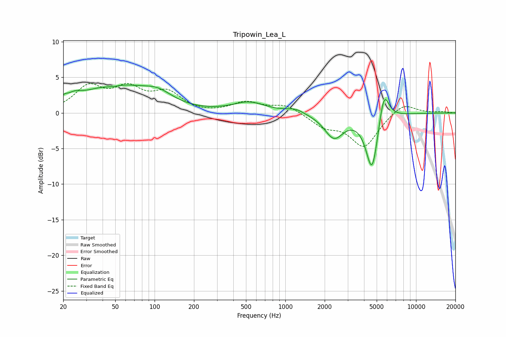

# Tripowin_Lea_L
See [usage instructions](https://github.com/jaakkopasanen/AutoEq#usage) for more options and info.

### Parametric EQs
Apply preamp of -4.0 dB when using parametric equalizer.

|   # | Type    |   Fc (Hz) |    Q |   Gain (dB) |
|-----|---------|-----------|------|-------------|
|   1 | Peaking |        20 | 5.94 |         0.6 |
|   2 | Peaking |        24 | 2.44 |         1   |
|   3 | Peaking |        48 | 1.97 |        -0.6 |
|   4 | Peaking |        48 | 0.65 |         3.9 |
|   5 | Peaking |       105 | 1.18 |         1.8 |
|   6 | Peaking |       528 | 1.13 |         1.4 |
|   7 | Peaking |      1192 | 2.18 |         0.6 |
|   8 | Peaking |      2355 | 1.94 |        -3.3 |
|   9 | Peaking |      4614 | 2.95 |        -8.3 |
|  10 | Peaking |      5673 | 3.51 |         4.8 |

### Fixed Band EQs
When using fixed band (also called graphic) equalizer, apply preamp of **-4.2 dB** (if available) and set gains manually with these parameters.

|   # | Type    |   Fc (Hz) |    Q |   Gain (dB) |
|-----|---------|-----------|------|-------------|
|   1 | Peaking |        31 | 1.41 |         3.4 |
|   2 | Peaking |        62 | 1.41 |         3   |
|   3 | Peaking |       125 | 1.41 |         2.6 |
|   4 | Peaking |       250 | 1.41 |        -0.2 |
|   5 | Peaking |       500 | 1.41 |         1.4 |
|   6 | Peaking |      1000 | 1.41 |         1.1 |
|   7 | Peaking |      2000 | 1.41 |        -1.7 |
|   8 | Peaking |      4000 | 1.41 |        -4.7 |
|   9 | Peaking |      8000 | 1.41 |         1.5 |
|  10 | Peaking |     16000 | 1.41 |         0.2 |

### Graphs

