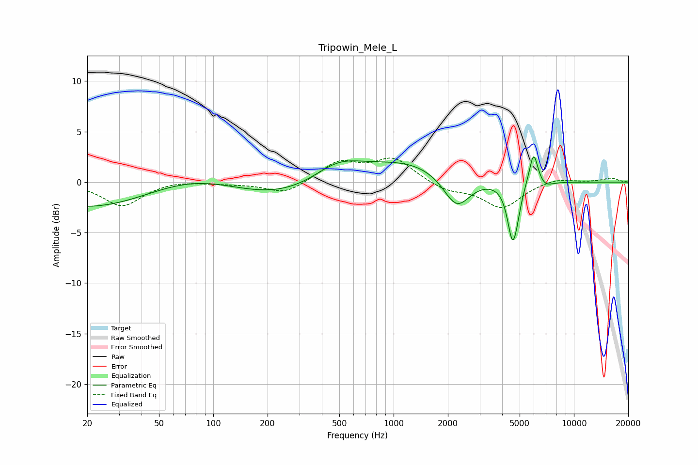

# Tripowin_Mele_L
See [usage instructions](https://github.com/jaakkopasanen/AutoEq#usage) for more options and info.

### Parametric EQs
Apply preamp of -2.6 dB when using parametric equalizer.

|   # | Type    |   Fc (Hz) |    Q |   Gain (dB) |
|-----|---------|-----------|------|-------------|
|   1 | Peaking |        63 | 0.18 |        -4.7 |
|   2 | Peaking |        78 | 0.44 |         4.4 |
|   3 | Peaking |       491 | 1    |         2.1 |
|   4 | Peaking |      1206 | 0.56 |         2.1 |
|   5 | Peaking |      2238 | 1.88 |        -3.4 |
|   6 | Peaking |      4565 | 4.92 |        -5.4 |
|   7 | Peaking |      4827 | 6    |        -0.9 |
|   8 | Peaking |      4955 | 5.99 |        -0   |
|   9 | Peaking |      5974 | 5.61 |         3.4 |
|  10 | Peaking |      6911 | 3.57 |        -0.6 |

### Fixed Band EQs
When using fixed band (also called graphic) equalizer, apply preamp of **-2.5 dB** (if available) and set gains manually with these parameters.

|   # | Type    |   Fc (Hz) |    Q |   Gain (dB) |
|-----|---------|-----------|------|-------------|
|   1 | Peaking |        31 | 1.41 |        -2.4 |
|   2 | Peaking |        62 | 1.41 |         0.2 |
|   3 | Peaking |       125 | 1.41 |        -0.1 |
|   4 | Peaking |       250 | 1.41 |        -1.2 |
|   5 | Peaking |       500 | 1.41 |         2   |
|   6 | Peaking |      1000 | 1.41 |         2.3 |
|   7 | Peaking |      2000 | 1.41 |        -0.8 |
|   8 | Peaking |      4000 | 1.41 |        -2.5 |
|   9 | Peaking |      8000 | 1.41 |         0.5 |
|  10 | Peaking |     16000 | 1.41 |         0.4 |

### Graphs

