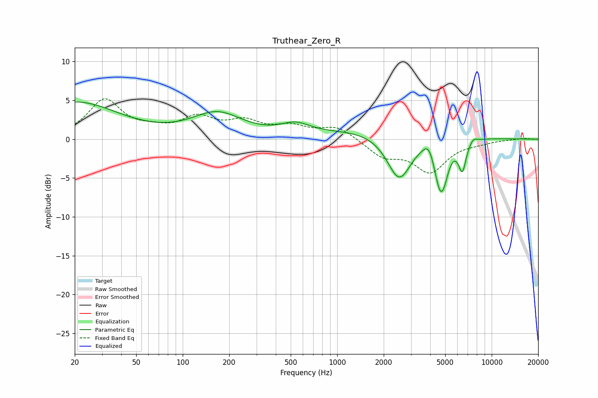

# Truthear_Zero_R
See [usage instructions](https://github.com/jaakkopasanen/AutoEq#usage) for more options and info.

### Parametric EQs
Apply preamp of -4.9 dB when using parametric equalizer.

|   # | Type    |   Fc (Hz) |    Q |   Gain (dB) |
|-----|---------|-----------|------|-------------|
|   1 | Peaking |        20 | 0.5  |         4.7 |
|   2 | Peaking |       167 | 0.87 |         3.2 |
|   3 | Peaking |       536 | 1.5  |         1.4 |
|   4 | Peaking |      2213 | 0.37 |         1.5 |
|   5 | Peaking |      2519 | 1.75 |        -6.2 |
|   6 | Peaking |      3921 | 3.96 |         1.7 |
|   7 | Peaking |      4646 | 3.42 |        -6.3 |
|   8 | Peaking |      4957 | 4.78 |        -1.3 |
|   9 | Peaking |      6454 | 5.46 |        -3.7 |
|  10 | Peaking |      7607 | 5.6  |         0.6 |

### Fixed Band EQs
When using fixed band (also called graphic) equalizer, apply preamp of **-5.3 dB** (if available) and set gains manually with these parameters.

|   # | Type    |   Fc (Hz) |    Q |   Gain (dB) |
|-----|---------|-----------|------|-------------|
|   1 | Peaking |        31 | 1.41 |         4.9 |
|   2 | Peaking |        62 | 1.41 |         0.8 |
|   3 | Peaking |       125 | 1.41 |         2.5 |
|   4 | Peaking |       250 | 1.41 |         2   |
|   5 | Peaking |       500 | 1.41 |         1.4 |
|   6 | Peaking |      1000 | 1.41 |         1.6 |
|   7 | Peaking |      2000 | 1.41 |        -2.1 |
|   8 | Peaking |      4000 | 1.41 |        -4   |
|   9 | Peaking |      8000 | 1.41 |        -0.3 |
|  10 | Peaking |     16000 | 1.41 |         0.1 |

### Graphs

