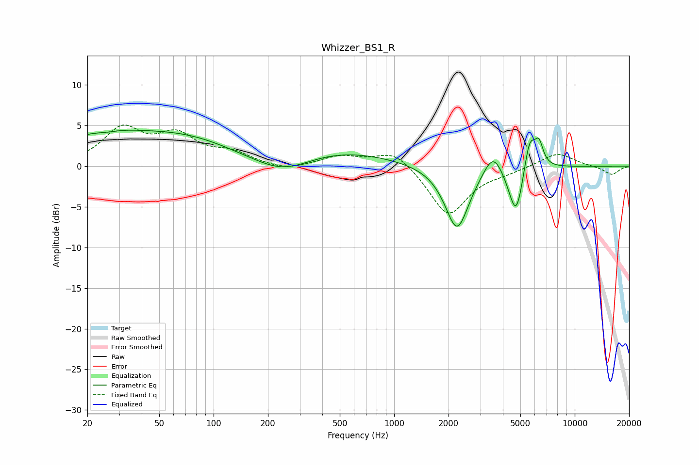

# Whizzer_BS1_R
See [usage instructions](https://github.com/jaakkopasanen/AutoEq#usage) for more options and info.

### Parametric EQs
Apply preamp of -4.5 dB when using parametric equalizer.

|   # | Type    |   Fc (Hz) |    Q |   Gain (dB) |
|-----|---------|-----------|------|-------------|
|   1 | Peaking |        25 | 0.46 |         3.7 |
|   2 | Peaking |        26 | 2.73 |        -0.2 |
|   3 | Peaking |        77 | 0.58 |         2.3 |
|   4 | Peaking |       244 | 0.87 |        -2.4 |
|   5 | Peaking |       452 | 0.46 |         2.1 |
|   6 | Peaking |      2229 | 2.11 |        -8   |
|   7 | Peaking |      3531 | 2.68 |         3   |
|   8 | Peaking |      4737 | 3.37 |        -6.5 |
|   9 | Peaking |      5623 | 4.28 |         4.5 |
|  10 | Peaking |      6340 | 5.98 |         2.7 |

### Fixed Band EQs
When using fixed band (also called graphic) equalizer, apply preamp of **-5.2 dB** (if available) and set gains manually with these parameters.

|   # | Type    |   Fc (Hz) |    Q |   Gain (dB) |
|-----|---------|-----------|------|-------------|
|   1 | Peaking |        31 | 1.41 |         4.4 |
|   2 | Peaking |        62 | 1.41 |         3.4 |
|   3 | Peaking |       125 | 1.41 |         1.4 |
|   4 | Peaking |       250 | 1.41 |        -0.6 |
|   5 | Peaking |       500 | 1.41 |         1.2 |
|   6 | Peaking |      1000 | 1.41 |         2.1 |
|   7 | Peaking |      2000 | 1.41 |        -6.1 |
|   8 | Peaking |      4000 | 1.41 |        -0.5 |
|   9 | Peaking |      8000 | 1.41 |         1.7 |
|  10 | Peaking |     16000 | 1.41 |        -1.1 |

### Graphs

