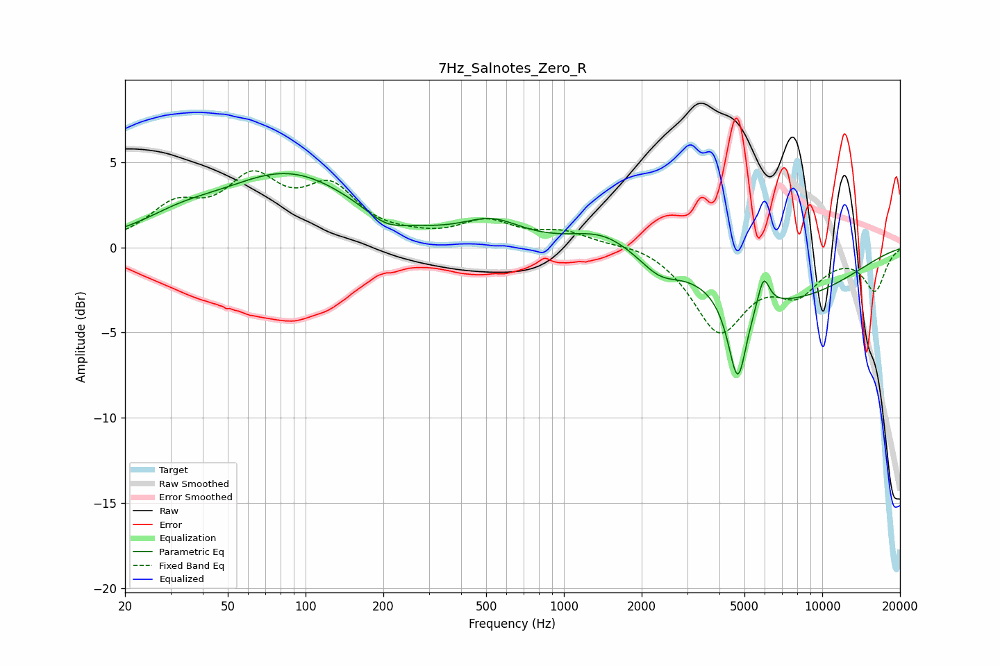

# 7Hz_Salnotes_Zero_R
See [usage instructions](https://github.com/jaakkopasanen/AutoEq#usage) for more options and info.

### Parametric EQs
Apply preamp of -4.4 dB when using parametric equalizer.

|   # | Type    |   Fc (Hz) |    Q |   Gain (dB) |
|-----|---------|-----------|------|-------------|
|   1 | Peaking |        33 | 0.96 |         0.9 |
|   2 | Peaking |        86 | 0.53 |         4.2 |
|   3 | Peaking |       204 | 1.88 |        -0.8 |
|   4 | Peaking |       527 | 1.23 |         1.3 |
|   5 | Peaking |      1412 | 1.16 |         1.1 |
|   6 | Peaking |      2342 | 1.87 |        -1   |
|   7 | Peaking |      4734 | 3.68 |        -6.8 |
|   8 | Peaking |      4865 | 3.54 |         1.6 |
|   9 | Peaking |      5923 | 6    |         1.9 |
|  10 | Peaking |      7172 | 0.46 |        -2.8 |

### Fixed Band EQs
When using fixed band (also called graphic) equalizer, apply preamp of **-4.6 dB** (if available) and set gains manually with these parameters.

|   # | Type    |   Fc (Hz) |    Q |   Gain (dB) |
|-----|---------|-----------|------|-------------|
|   1 | Peaking |        31 | 1.41 |         2.1 |
|   2 | Peaking |        62 | 1.41 |         3.5 |
|   3 | Peaking |       125 | 1.41 |         3.1 |
|   4 | Peaking |       250 | 1.41 |         0.3 |
|   5 | Peaking |       500 | 1.41 |         1.4 |
|   6 | Peaking |      1000 | 1.41 |         0.8 |
|   7 | Peaking |      2000 | 1.41 |         0.4 |
|   8 | Peaking |      4000 | 1.41 |        -4.8 |
|   9 | Peaking |      8000 | 1.41 |        -2.2 |
|  10 | Peaking |     16000 | 1.41 |        -2.4 |

### Graphs

