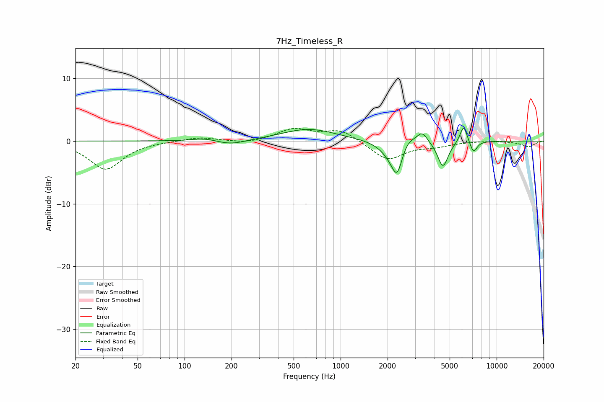

# 7Hz_Timeless_R
See [usage instructions](https://github.com/jaakkopasanen/AutoEq#usage) for more options and info.

### Parametric EQs
Apply preamp of -2.2 dB when using parametric equalizer.

|   # | Type    |   Fc (Hz) |    Q |   Gain (dB) |
|-----|---------|-----------|------|-------------|
|   1 | Peaking |       135 | 1.78 |         0.5 |
|   2 | Peaking |       198 | 1.48 |        -0.8 |
|   3 | Peaking |       625 | 0.82 |         1.9 |
|   4 | Peaking |      2100 | 2.01 |        -1.8 |
|   5 | Peaking |      2311 | 3.79 |        -5.3 |
|   6 | Peaking |      2577 | 2.39 |         2.2 |
|   7 | Peaking |      3337 | 4.27 |         1.6 |
|   8 | Peaking |      4527 | 4.19 |        -4.2 |
|   9 | Peaking |      6145 | 6    |         2.9 |
|  10 | Peaking |      7109 | 6    |        -1.9 |

### Fixed Band EQs
When using fixed band (also called graphic) equalizer, apply preamp of **-2.1 dB** (if available) and set gains manually with these parameters.

|   # | Type    |   Fc (Hz) |    Q |   Gain (dB) |
|-----|---------|-----------|------|-------------|
|   1 | Peaking |        31 | 1.41 |        -4.5 |
|   2 | Peaking |        62 | 1.41 |        -0   |
|   3 | Peaking |       125 | 1.41 |         0.6 |
|   4 | Peaking |       250 | 1.41 |        -0.4 |
|   5 | Peaking |       500 | 1.41 |         1.9 |
|   6 | Peaking |      1000 | 1.41 |         1.8 |
|   7 | Peaking |      2000 | 1.41 |        -3   |
|   8 | Peaking |      4000 | 1.41 |        -0.7 |
|   9 | Peaking |      8000 | 1.41 |         0.1 |
|  10 | Peaking |     16000 | 1.41 |        -0.9 |

### Graphs

