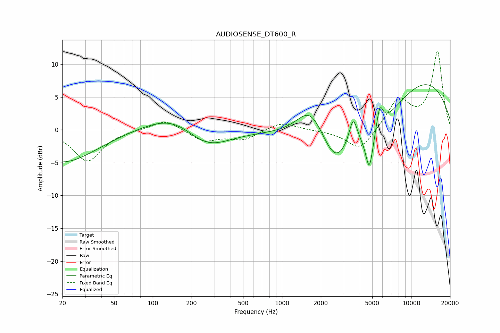

# AUDIOSENSE_DT600_R
See [usage instructions](https://github.com/jaakkopasanen/AutoEq#usage) for more options and info.

### Parametric EQs
Apply preamp of -7.0 dB when using parametric equalizer.

|   # | Type    |   Fc (Hz) |    Q |   Gain (dB) |
|-----|---------|-----------|------|-------------|
|   1 | Peaking |        20 | 0.54 |        -5   |
|   2 | Peaking |       155 | 0.64 |         3.3 |
|   3 | Peaking |       253 | 0.77 |        -3.9 |
|   4 | Peaking |      1656 | 1.34 |         4.8 |
|   5 | Peaking |      2573 | 1.55 |        -3.9 |
|   6 | Peaking |      3559 | 4.44 |         4.2 |
|   7 | Peaking |      4752 | 4.87 |        -5.8 |
|   8 | Peaking |      5172 | 0.38 |        -7.9 |
|   9 | Peaking |      5725 | 5.55 |         3.5 |
|  10 | Peaking |     10000 | 0.32 |        11.1 |

### Fixed Band EQs
When using fixed band (also called graphic) equalizer, apply preamp of **-12.0 dB** (if available) and set gains manually with these parameters.

|   # | Type    |   Fc (Hz) |    Q |   Gain (dB) |
|-----|---------|-----------|------|-------------|
|   1 | Peaking |        31 | 1.41 |        -4.8 |
|   2 | Peaking |        62 | 1.41 |         0   |
|   3 | Peaking |       125 | 1.41 |         1.6 |
|   4 | Peaking |       250 | 1.41 |        -1.7 |
|   5 | Peaking |       500 | 1.41 |        -1.5 |
|   6 | Peaking |      1000 | 1.41 |         1.2 |
|   7 | Peaking |      2000 | 1.41 |        -0.1 |
|   8 | Peaking |      4000 | 1.41 |        -3.3 |
|   9 | Peaking |      8000 | 1.41 |         4.5 |
|  10 | Peaking |     16000 | 1.41 |        11.8 |

### Graphs

