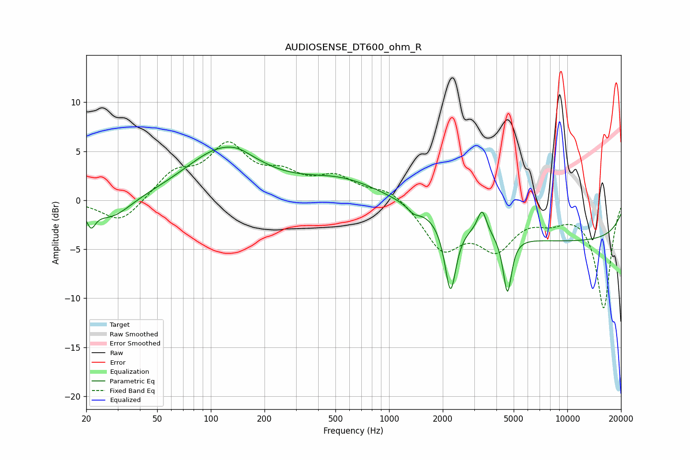

# AUDIOSENSE_DT600_ohm_R
See [usage instructions](https://github.com/jaakkopasanen/AutoEq#usage) for more options and info.

### Parametric EQs
Apply preamp of -5.5 dB when using parametric equalizer.

|   # | Type    |   Fc (Hz) |    Q |   Gain (dB) |
|-----|---------|-----------|------|-------------|
|   1 | Peaking |        21 | 5.67 |        -1.8 |
|   2 | Peaking |        28 | 1.31 |        -2.1 |
|   3 | Peaking |       117 | 0.68 |         5.1 |
|   4 | Peaking |       143 | 2.52 |         0.3 |
|   5 | Peaking |       544 | 0.64 |         2   |
|   6 | Peaking |      1373 | 4.15 |        -0.7 |
|   7 | Peaking |      2210 | 4.53 |        -7.3 |
|   8 | Peaking |      3324 | 5.55 |         2.5 |
|   9 | Peaking |      4611 | 6    |        -5.9 |
|  10 | Peaking |     10000 | 0.18 |        -4.1 |

### Fixed Band EQs
When using fixed band (also called graphic) equalizer, apply preamp of **-6.1 dB** (if available) and set gains manually with these parameters.

|   # | Type    |   Fc (Hz) |    Q |   Gain (dB) |
|-----|---------|-----------|------|-------------|
|   1 | Peaking |        31 | 1.41 |        -2.4 |
|   2 | Peaking |        62 | 1.41 |         2.6 |
|   3 | Peaking |       125 | 1.41 |         5.1 |
|   4 | Peaking |       250 | 1.41 |         2.1 |
|   5 | Peaking |       500 | 1.41 |         2.1 |
|   6 | Peaking |      1000 | 1.41 |         1.3 |
|   7 | Peaking |      2000 | 1.41 |        -4.7 |
|   8 | Peaking |      4000 | 1.41 |        -4.3 |
|   9 | Peaking |      8000 | 1.41 |        -1.4 |
|  10 | Peaking |     16000 | 1.41 |       -10.9 |

### Graphs

