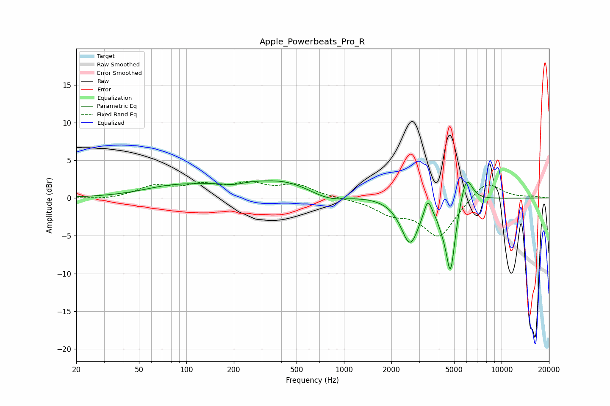

# Apple_Powerbeats_Pro_R
See [usage instructions](https://github.com/jaakkopasanen/AutoEq#usage) for more options and info.

### Parametric EQs
Apply preamp of -2.4 dB when using parametric equalizer.

|   # | Type    |   Fc (Hz) |    Q |   Gain (dB) |
|-----|---------|-----------|------|-------------|
|   1 | Peaking |        78 | 0.79 |         0.9 |
|   2 | Peaking |       199 | 2.02 |        -0.4 |
|   3 | Peaking |       343 | 0.34 |         2.3 |
|   4 | Peaking |       439 | 1.19 |         0.4 |
|   5 | Peaking |       801 | 1.07 |        -1.6 |
|   6 | Peaking |      2625 | 2.48 |        -6   |
|   7 | Peaking |      3401 | 6    |         2.3 |
|   8 | Peaking |      4171 | 4.94 |        -1.1 |
|   9 | Peaking |      4740 | 4.58 |        -9.5 |
|  10 | Peaking |      5978 | 3.65 |         3.8 |

### Fixed Band EQs
When using fixed band (also called graphic) equalizer, apply preamp of **-2.3 dB** (if available) and set gains manually with these parameters.

|   # | Type    |   Fc (Hz) |    Q |   Gain (dB) |
|-----|---------|-----------|------|-------------|
|   1 | Peaking |        31 | 1.41 |        -0.2 |
|   2 | Peaking |        62 | 1.41 |         1.5 |
|   3 | Peaking |       125 | 1.41 |         1.5 |
|   4 | Peaking |       250 | 1.41 |         1.6 |
|   5 | Peaking |       500 | 1.41 |         1.6 |
|   6 | Peaking |      1000 | 1.41 |        -0   |
|   7 | Peaking |      2000 | 1.41 |        -1.7 |
|   8 | Peaking |      4000 | 1.41 |        -5.1 |
|   9 | Peaking |      8000 | 1.41 |         2.5 |
|  10 | Peaking |     16000 | 1.41 |         0.2 |

### Graphs

