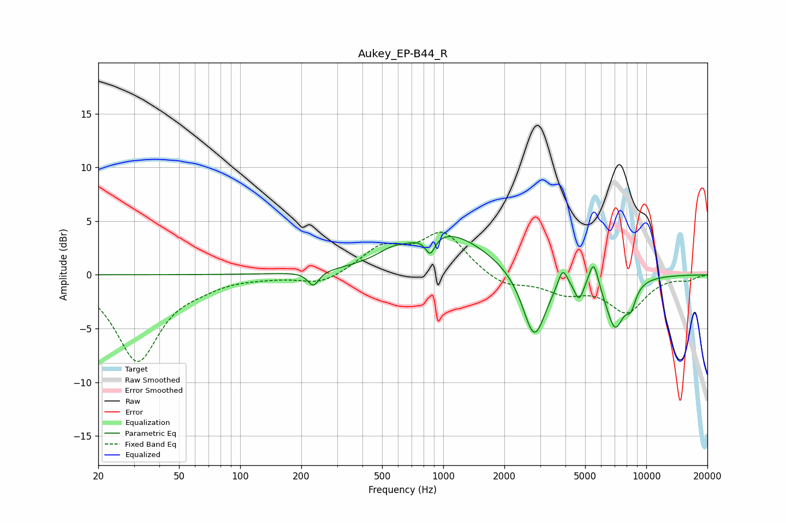

# Aukey_EP-B44_R
See [usage instructions](https://github.com/jaakkopasanen/AutoEq#usage) for more options and info.

### Parametric EQs
Apply preamp of -3.7 dB when using parametric equalizer.

|   # | Type    |   Fc (Hz) |    Q |   Gain (dB) |
|-----|---------|-----------|------|-------------|
|   1 | Peaking |       229 | 5.18 |        -1.4 |
|   2 | Peaking |       553 | 2.1  |         0.6 |
|   3 | Peaking |       863 | 6    |        -1.7 |
|   4 | Peaking |      1035 | 0.69 |         3.9 |
|   5 | Peaking |      2809 | 2.46 |        -6.4 |
|   6 | Peaking |      3874 | 6    |         1.8 |
|   7 | Peaking |      4666 | 6    |        -1.9 |
|   8 | Peaking |      5506 | 5.91 |         2.5 |
|   9 | Peaking |      7011 | 2.92 |        -4.7 |
|  10 | Peaking |      8402 | 5.05 |        -1.8 |

### Fixed Band EQs
When using fixed band (also called graphic) equalizer, apply preamp of **-4.1 dB** (if available) and set gains manually with these parameters.

|   # | Type    |   Fc (Hz) |    Q |   Gain (dB) |
|-----|---------|-----------|------|-------------|
|   1 | Peaking |        31 | 1.41 |        -8   |
|   2 | Peaking |        62 | 1.41 |        -0.6 |
|   3 | Peaking |       125 | 1.41 |        -0.1 |
|   4 | Peaking |       250 | 1.41 |        -1   |
|   5 | Peaking |       500 | 1.41 |         2.4 |
|   6 | Peaking |      1000 | 1.41 |         3.8 |
|   7 | Peaking |      2000 | 1.41 |        -1.1 |
|   8 | Peaking |      4000 | 1.41 |        -1.5 |
|   9 | Peaking |      8000 | 1.41 |        -3.3 |
|  10 | Peaking |     16000 | 1.41 |        -0.4 |

### Graphs

