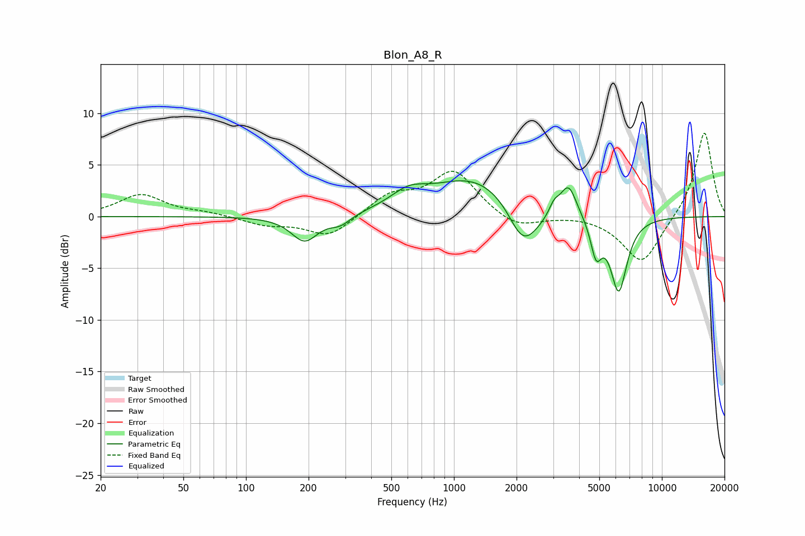

# Blon_A8_R
See [usage instructions](https://github.com/jaakkopasanen/AutoEq#usage) for more options and info.

### Parametric EQs
Apply preamp of -3.6 dB when using parametric equalizer.

|   # | Type    |   Fc (Hz) |    Q |   Gain (dB) |
|-----|---------|-----------|------|-------------|
|   1 | Peaking |       191 | 2.2  |        -2.5 |
|   2 | Peaking |       285 | 2.76 |        -0.9 |
|   3 | Peaking |       605 | 1.63 |         1.5 |
|   4 | Peaking |      1254 | 0.68 |         3.8 |
|   5 | Peaking |      2119 | 2.13 |        -3.3 |
|   6 | Peaking |      2403 | 1.89 |        -1.2 |
|   7 | Peaking |      3032 | 6    |         1   |
|   8 | Peaking |      3554 | 3.6  |         3.1 |
|   9 | Peaking |      4828 | 5.26 |        -3.4 |
|  10 | Peaking |      6200 | 3.42 |        -7.2 |

### Fixed Band EQs
When using fixed band (also called graphic) equalizer, apply preamp of **-8.2 dB** (if available) and set gains manually with these parameters.

|   # | Type    |   Fc (Hz) |    Q |   Gain (dB) |
|-----|---------|-----------|------|-------------|
|   1 | Peaking |        31 | 1.41 |         2.1 |
|   2 | Peaking |        62 | 1.41 |         0.3 |
|   3 | Peaking |       125 | 1.41 |        -0.8 |
|   4 | Peaking |       250 | 1.41 |        -2   |
|   5 | Peaking |       500 | 1.41 |         2   |
|   6 | Peaking |      1000 | 1.41 |         4.3 |
|   7 | Peaking |      2000 | 1.41 |        -1.3 |
|   8 | Peaking |      4000 | 1.41 |         0.2 |
|   9 | Peaking |      8000 | 1.41 |        -4.6 |
|  10 | Peaking |     16000 | 1.41 |         8.3 |

### Graphs

