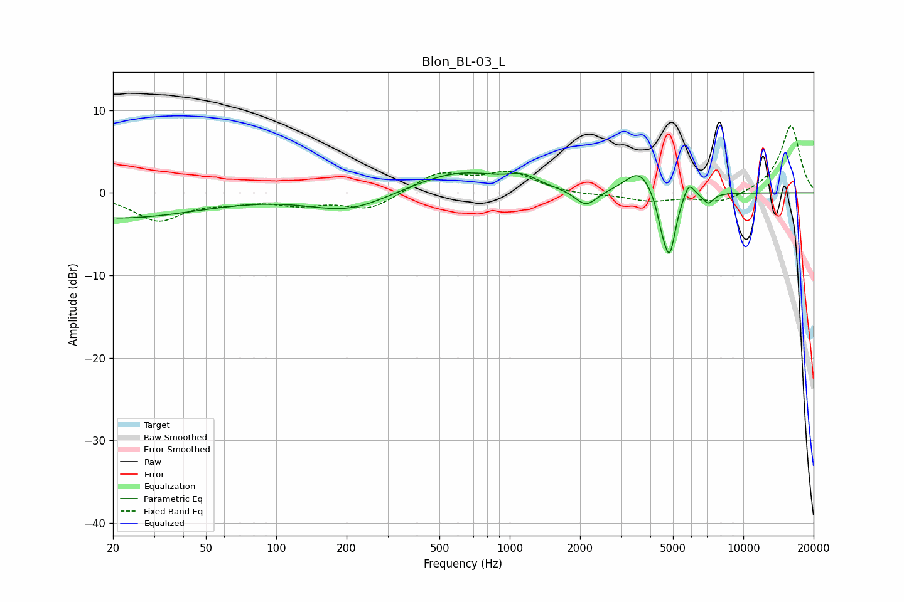

# Blon_BL-03_L
See [usage instructions](https://github.com/jaakkopasanen/AutoEq#usage) for more options and info.

### Parametric EQs
Apply preamp of -2.5 dB when using parametric equalizer.

|   # | Type    |   Fc (Hz) |    Q |   Gain (dB) |
|-----|---------|-----------|------|-------------|
|   1 | Peaking |        21 | 0.39 |        -3   |
|   2 | Peaking |       205 | 0.83 |        -2.2 |
|   3 | Peaking |       600 | 0.72 |         2.7 |
|   4 | Peaking |      1135 | 2.29 |         1.1 |
|   5 | Peaking |      2120 | 3    |        -2   |
|   6 | Peaking |      3582 | 2.42 |         2.9 |
|   7 | Peaking |      4487 | 6    |        -2.3 |
|   8 | Peaking |      4841 | 5.25 |        -7.2 |
|   9 | Peaking |      5843 | 5.97 |         1.9 |
|  10 | Peaking |      7072 | 6    |        -1.3 |

### Fixed Band EQs
When using fixed band (also called graphic) equalizer, apply preamp of **-8.2 dB** (if available) and set gains manually with these parameters.

|   # | Type    |   Fc (Hz) |    Q |   Gain (dB) |
|-----|---------|-----------|------|-------------|
|   1 | Peaking |        31 | 1.41 |        -3.2 |
|   2 | Peaking |        62 | 1.41 |        -0.8 |
|   3 | Peaking |       125 | 1.41 |        -1.2 |
|   4 | Peaking |       250 | 1.41 |        -2   |
|   5 | Peaking |       500 | 1.41 |         2.4 |
|   6 | Peaking |      1000 | 1.41 |         2.3 |
|   7 | Peaking |      2000 | 1.41 |        -0.3 |
|   8 | Peaking |      4000 | 1.41 |        -1   |
|   9 | Peaking |      8000 | 1.41 |        -1.3 |
|  10 | Peaking |     16000 | 1.41 |         8.2 |

### Graphs

