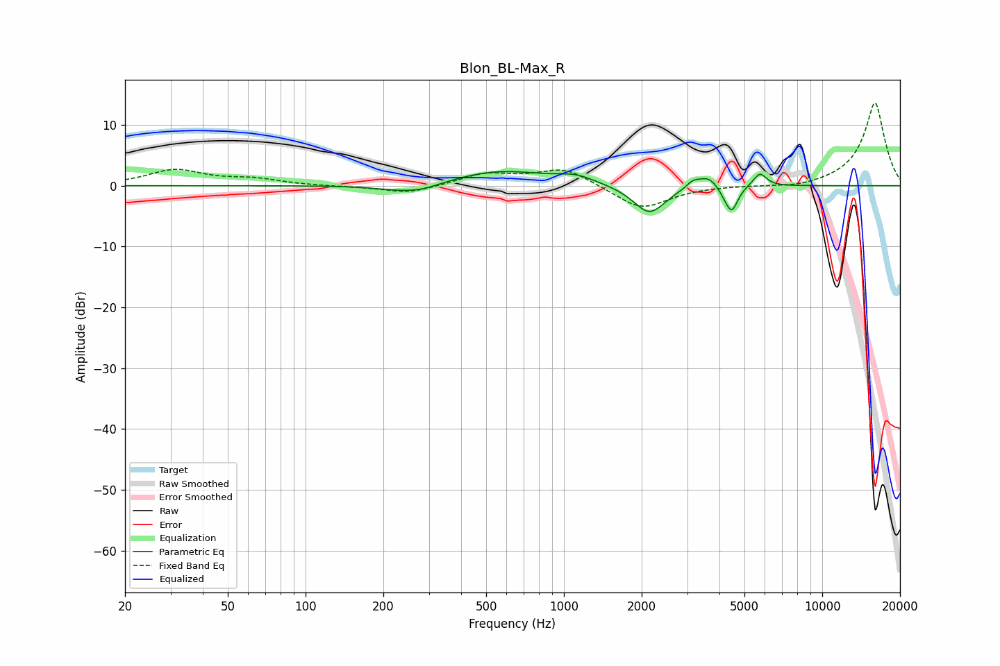

# Blon_BL-Max_R
See [usage instructions](https://github.com/jaakkopasanen/AutoEq#usage) for more options and info.

### Parametric EQs
Apply preamp of -2.4 dB when using parametric equalizer.

|   # | Type    |   Fc (Hz) |    Q |   Gain (dB) |
|-----|---------|-----------|------|-------------|
|   1 | Peaking |       253 | 1.23 |        -1.4 |
|   2 | Peaking |       287 | 2.29 |        -0.3 |
|   3 | Peaking |       562 | 0.75 |         2.5 |
|   4 | Peaking |      1114 | 1.99 |         1.2 |
|   5 | Peaking |      2143 | 2.26 |        -4.8 |
|   6 | Peaking |      3147 | 6    |         0.9 |
|   7 | Peaking |      3624 | 3.19 |         2.1 |
|   8 | Peaking |      4222 | 4.82 |        -1.3 |
|   9 | Peaking |      4471 | 6    |        -3.8 |
|  10 | Peaking |      5735 | 5.42 |         2.2 |

### Fixed Band EQs
When using fixed band (also called graphic) equalizer, apply preamp of **-13.7 dB** (if available) and set gains manually with these parameters.

|   # | Type    |   Fc (Hz) |    Q |   Gain (dB) |
|-----|---------|-----------|------|-------------|
|   1 | Peaking |        31 | 1.41 |         2.5 |
|   2 | Peaking |        62 | 1.41 |         1   |
|   3 | Peaking |       125 | 1.41 |        -0.1 |
|   4 | Peaking |       250 | 1.41 |        -1.3 |
|   5 | Peaking |       500 | 1.41 |         1.9 |
|   6 | Peaking |      1000 | 1.41 |         2.9 |
|   7 | Peaking |      2000 | 1.41 |        -4   |
|   8 | Peaking |      4000 | 1.41 |         0   |
|   9 | Peaking |      8000 | 1.41 |        -0.5 |
|  10 | Peaking |     16000 | 1.41 |        13.7 |

### Graphs

