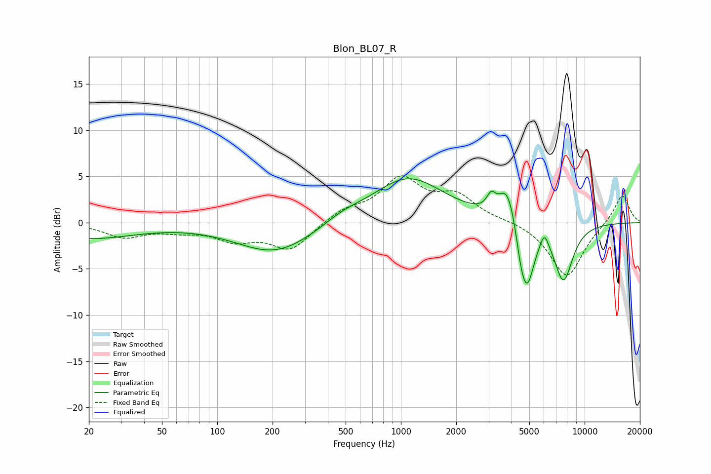

# Blon_BL07_R
See [usage instructions](https://github.com/jaakkopasanen/AutoEq#usage) for more options and info.

### Parametric EQs
Apply preamp of -4.8 dB when using parametric equalizer.

|   # | Type    |   Fc (Hz) |    Q |   Gain (dB) |
|-----|---------|-----------|------|-------------|
|   1 | Peaking |        20 | 0.56 |        -1.7 |
|   2 | Peaking |       208 | 0.67 |        -3.3 |
|   3 | Peaking |       479 | 1.37 |         0.8 |
|   4 | Peaking |      1093 | 0.72 |         4.9 |
|   5 | Peaking |      3099 | 6    |         1.5 |
|   6 | Peaking |      3804 | 2.9  |         4.1 |
|   7 | Peaking |      4479 | 5.99 |        -1.6 |
|   8 | Peaking |      4851 | 3.39 |        -7   |
|   9 | Peaking |      6037 | 6    |         1.6 |
|  10 | Peaking |      7676 | 2.59 |        -6.1 |

### Fixed Band EQs
When using fixed band (also called graphic) equalizer, apply preamp of **-5.2 dB** (if available) and set gains manually with these parameters.

|   # | Type    |   Fc (Hz) |    Q |   Gain (dB) |
|-----|---------|-----------|------|-------------|
|   1 | Peaking |        31 | 1.41 |        -1.5 |
|   2 | Peaking |        62 | 1.41 |        -0.7 |
|   3 | Peaking |       125 | 1.41 |        -1.7 |
|   4 | Peaking |       250 | 1.41 |        -2.9 |
|   5 | Peaking |       500 | 1.41 |         1.2 |
|   6 | Peaking |      1000 | 1.41 |         4.5 |
|   7 | Peaking |      2000 | 1.41 |         2.6 |
|   8 | Peaking |      4000 | 1.41 |         0.2 |
|   9 | Peaking |      8000 | 1.41 |        -5.9 |
|  10 | Peaking |     16000 | 1.41 |         3.2 |

### Graphs

