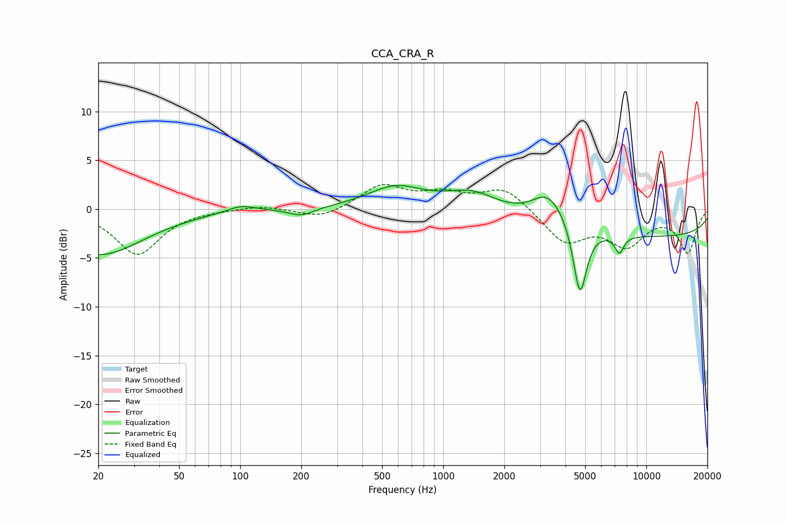

# CCA_CRA_R
See [usage instructions](https://github.com/jaakkopasanen/AutoEq#usage) for more options and info.

### Parametric EQs
Apply preamp of -2.5 dB when using parametric equalizer.

|   # | Type    |   Fc (Hz) |    Q |   Gain (dB) |
|-----|---------|-----------|------|-------------|
|   1 | Peaking |        20 | 0.64 |        -4.7 |
|   2 | Peaking |       101 | 2.04 |         0.7 |
|   3 | Peaking |       200 | 2.29 |        -0.8 |
|   4 | Peaking |       582 | 1.04 |         2.2 |
|   5 | Peaking |      1389 | 1.08 |         2   |
|   6 | Peaking |      3114 | 2.55 |         0.6 |
|   7 | Peaking |      3427 | 1.48 |         2.9 |
|   8 | Peaking |      4713 | 4.19 |        -7.5 |
|   9 | Peaking |      7371 | 6    |        -1.8 |
|  10 | Peaking |     10000 | 0.18 |        -2.8 |

### Fixed Band EQs
When using fixed band (also called graphic) equalizer, apply preamp of **-2.6 dB** (if available) and set gains manually with these parameters.

|   # | Type    |   Fc (Hz) |    Q |   Gain (dB) |
|-----|---------|-----------|------|-------------|
|   1 | Peaking |        31 | 1.41 |        -4.6 |
|   2 | Peaking |        62 | 1.41 |        -0   |
|   3 | Peaking |       125 | 1.41 |         0.4 |
|   4 | Peaking |       250 | 1.41 |        -1   |
|   5 | Peaking |       500 | 1.41 |         2.4 |
|   6 | Peaking |      1000 | 1.41 |         1.4 |
|   7 | Peaking |      2000 | 1.41 |         2.2 |
|   8 | Peaking |      4000 | 1.41 |        -3.3 |
|   9 | Peaking |      8000 | 1.41 |        -3.4 |
|  10 | Peaking |     16000 | 1.41 |        -4.3 |

### Graphs

